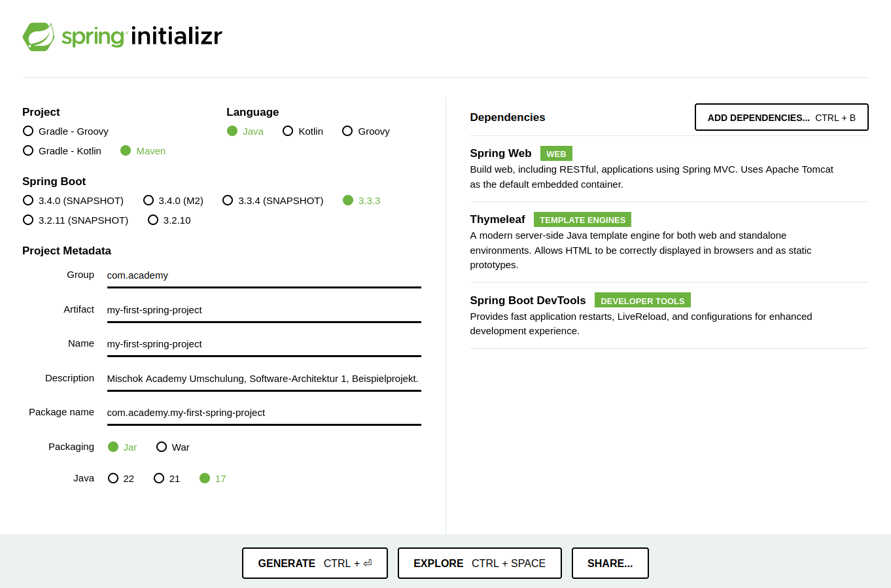
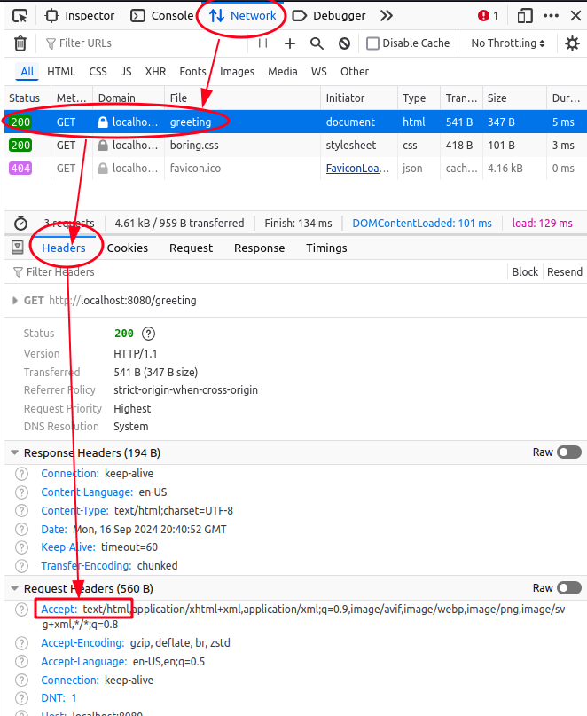
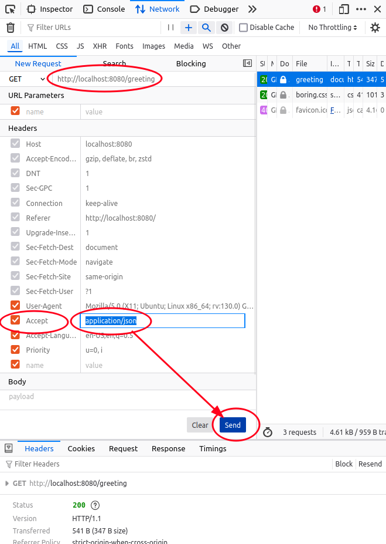
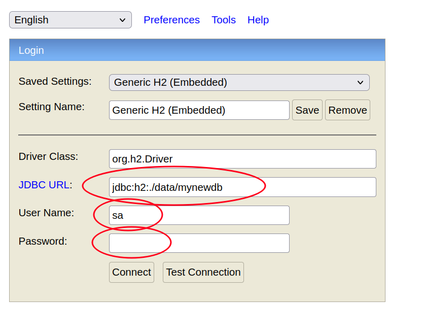
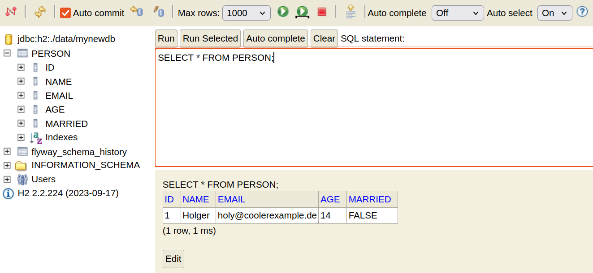

# My first Spring Backend (+Thymeleaf Frontend, auch mit JSON als Antwort)

Das hier ist eine Schritt-für-Schritt-Anleitung für die Erstellung eines ersten [Spring](https://spring.io/) Backends.
Entstanden im Rahmen vom Modul "Software-Architektur 1" in der Mischok Academy.

<!-- this adds a Table of Contents in gitlab flavored markdown, but does not work on github. -->

<!-- [[_TOC_]] -->


## 0) Einleitung

### 0.a) Für Dozierende und Wiederholungstäter
Beim YouTuber *Amigoscode* gibt es ein ganz nettes, fixes, nur 97-minütiges Video [Spring Boot Tutorial | Full Course [2023] [NEW]](https://www.youtube.com/watch?v=9SGDpanrc8U), in dem er mit nur wenigen Unterschieden zur Vorgehensweise aus der folgenden Anleitung die Basics erklärt.
Wer schon die Grundlagen von Spring mal gesehen hat, ist dort gut aufgehoben.
Im Video werden aber weniger Sachen behandelt, als in dieser Anleitung.
Das hier sind alle Unterschiede, die ich beim ersten Erstellen der Anleitung (Alex, September 2024) beim schnellen Anschauen gesehen habe.
Im Video nicht bearbeitete Konzepte stehen nicht in dieser Liste:
- benutzt nicht ***Lombok***, aber erwähnt es
- benutzt nicht ***Flyway***
- Datenbank mit ***Postgres***, nicht mit ***H2***
  - erstellt in Postgres CLI eine Datenbank, gibt dann dem eigenen User alle Rechte, dessen Authentication er in die `application.properties` legt?? (vor 40:00)
- benutzt **kein Thymeleaf**, als Rückgabe **nur JSON**
  - Controller-Klasse mit `@RestController`, statt `@Controller`, sodass man sich bei JSON-Rückgabe bei den Endpunkten die Annotation `@ResponseBody` sparen kann (wird bei Thymeleaf-Rückgabe evtl stören)
  - am Anfang schreibt er einen GET-Endpunkt mit den nötigen Annotations direkt bei der Klasse mit `main` rein, lagert das aber später in eigene Klasse aus
  - benutzt `@RequestMapping` bei Controllerklasse, um allen den gleichen Pfad zu geben
- **Ordnerstruktur**: für jede Entity eigenen Ordner mit den Klassen, statt einen Ordner mit allen Controllern, einen mit allen Services etc
- erwähnt Annotation `@Transient` bei Entity-Klasse, um das Feld wegzulassen bei der Persistierung durch JPA
- nutzt `@Transactional`, um eine Entity mit `.setName(...)` zu updaten
  - benutzt dabei aber PUT, statt PATCH, obwohl er nur einzelne Sachen mitgibt und aktualisiert, statt der ganzen Entity


### 0.b) Was wir bauen
Eine funktionierende, kleine ***Spring***-Anwendung.
Ausgangspunkt ist ein ausführliches [Spring Tutorial zu "*Serving Web Content with Spring MVC*"](https://spring.io/guides/gs/serving-web-content), falls man es selbst mal durchlesen möchte (lückenhaft und teilweise nicht so gut).
In unserer Anleitung gehen wir darüber hinaus und nutzen u.a. Annotations von **Lombok**, bekommen auch **JSON** als Antwort von unseren Endpunkten, verschicken **POST-Requests** und binden eine **H2-Datenbank** ein.

Folgende Funktionalitäten werden wir haben:
- Dependencies verwalten mit ***Maven*** in einer `pom.xml`
- **GET**- und **POST-Requests** annehmen, Ausblick auch auf **PUT** und **DELETE**
  - Anfrage
    - GET zuerst nur mit der URL-Zeile vom Browser
    - für POST dann mit `curl` aus dem Terminal
    - später alles über klickbare Links und **Formulare** (HTML oder Thymeleaf, `<form>`-Tag)
  - Antwort
    - mit ***Thymeleaf*** direkt eine HTML-Seite als renderbares Frontend
    - oder einfach Daten als **JSON**
      - später auch mit selbst gesetztem *HTTP-Status-Code* und weiteren Informationen im *HTTP-Header* (TODO ALEX)
- mit Code-Generator ***Lombok*** sparen wir uns Boilerplate-Code und lernen **Annotations** kennen
- ganz normale HTML-Seiten anzeigen
- Datenbank zum Speichern von Daten
  - wir nutzen ***H2***, zuerst *In-Memory*, dann auch persistiert lokal als Datei
  - dank Spring ***JPA*** sparen wir uns eigene SQL-Queries
  - *Datenbank-Migrations* mit ***Flyway***, um initiale Queries und andere Datenbankänderungen reproduzierbar und automatisiert durchzuführen
- *Automatisierte Tests* (Coming Soon, im Modul Software-Architektur 2)


### 0.c) Voraussetzungen
- Vorwissen:
  - **Java** Grundlagen
  - **HTML** und **CSS** Grundlagen
  - ***Terminal*** in einem Ordner öffnen und keine Angst davor haben
  - optional: ***git*** installiert und Grundlagen dafür gelernt, um nach jedem Schritt (oder nach wenigen Schritten) einen schönen neuen Commit anzulegen
    - am Ende dieser Anleitung, im [Anhang](#section-appendix), gibt es einen [Refresher](#section-appendix-git) zu git
- Betriebssystem: ***Ubuntu*** wäre gut
- im Terminal installierte/verfügbare Programme:
  - **mvn**
  - **curl**
- ***IntelliJ*** oder anderer Editor / IDE
  - mit Java ***17*** oder höher


## 1) Start und ein erster Endpunkt

### 1.a) Leeres Spring Projekt mit passenden Dependencies erstellen

Wir starten mit der Grundstruktur, die wir aus dem [Spring initializr](https://start.spring.io/) herausbekommen.

- entweder die Vorauswahl in [diesem pre-initialized project](https://start.spring.io/#!type=maven-project&language=java&packaging=jar&jvmVersion=17&groupId=com.example&artifactId=my_first_spring_project&name=my_first_spring_project&description=Spring-Projekt%20mit%20grundlegenden%20Funktionen&packageName=com.example.my_first_spring_project&dependencies=web,thymeleaf,devtools) nehmen, Textfelder ausfüllen und mit Klick auf den Button "GENERATE" herunterladen
- oder selbst im [Spring initializr](https://start.spring.io/) mit Auswahl:
  - Maven als Buildtool
  - Textfelder passend ausfüllen
  - Dependencies auswählen:
    - Spring Web
    - Thymeleaf
    - Spring Boot DevTools
- diese Dependencies liegen dann direkt in unserer Maven-Verwaltungs-Datei `pom.xml`:
  ```xml
  <dependency>
    <groupId>org.springframework.boot</groupId>
    <artifactId>spring-boot-starter-thymeleaf</artifactId>
  </dependency>
  <dependency>
    <groupId>org.springframework.boot</groupId>
    <artifactId>spring-boot-starter-web</artifactId>
  </dependency>

  <dependency>
    <groupId>org.springframework.boot</groupId>
    <artifactId>spring-boot-devtools</artifactId>
    <scope>runtime</scope>
    <optional>true</optional>
  </dependency>
  <dependency>
    <groupId>org.springframework.boot</groupId>
    <artifactId>spring-boot-starter-test</artifactId>
    <scope>test</scope>
  </dependency>
  ```
- dieses Startprojekt am besten direkt auch mit Hilfe von **git** versionieren, optional auch remote auf GitLab oder GitHub, und im Laufe der Anleitung passende Commits erstellen.
  Mit git kannst du deine Fortschritte sauber und nachhaltig festhalten und mit anderen Teilen.
  Das hat keinen direkten Einfluss auf deinen fertigen Code.
  Wenn du git noch nicht kennst, kannst du also auch ohne git weiter machen.
  Im Anhang, ganz am Ende der Anleitung, findest du einen minimalen Refresher zu git.


### 1.b) in IntelliJ öffnen und einfachen GET-Endpunkt erstellen
- in IntelliJ öffnen, am besten direkt die `pom.xml` auswählen
- erstelle neben der main-Klasse auch eine Klasse `GreetingController.java` als Controller für unsere Endpunkte
	- zuerst komplett ohne RequestParam, nur mit `Model model` für Thymeleaf
    ```java
    package com.academy.my_first_spring_project;

    import org.springframework.stereotype.Controller;
    import org.springframework.ui.Model;
    import org.springframework.web.bind.annotation.GetMapping;

    @Controller
    public class GreetingController {

        @GetMapping("/greeting")
        public String greeting(Model model) {
            return "greeting";
        }
    }
    ```
- erstelle `greeting.html` in `src/main/resources/templates`, mit folgenden Code (genommen aus der [Spring-Anleitung](https://spring.io/guides/gs/serving-web-content#initial), aber hier noch `${name}` rausgenommen)
  - **ACHTUNG!**: die einzelnen Anführungszeichen um `Hello World!` im folgenden Beispielcode sind wichtig!
    Durch die doppelten Anführungszeichen wird erst der Input für Thymeleaf ermöglicht, aber dann muss man die einzelnen Anführungszeichen noch als String-Delimiter setzen.
    Das nicht zu tun, wäre so falsch, wie in Java `String text = Hello World!;` ohne String-Delimiter zu schreiben.
    ```html
    <!DOCTYPE HTML>
    <html xmlns:th="http://www.thymeleaf.org">
    <head>
        <title>Hallo :-)</title>
        <meta http-equiv="Content-Type" content="text/html; charset=UTF-8" />
    </head>
    <body>
      <p th:text="'Hello World!'"></p>
    </body>
    </html>
    ```


### 1.c) Backend lokal laufen lassen mit maven
Zum Ausführen des Projekts lernen wir zwei Möglichkeiten:
- in einer IDE: bei IntelliJ auf Play drücken, oder vorher Rechtsklick auf die `pom.xml` und dort "Ausführen" (mit grünem Play-Symbol daneben) oder sowas anklicken, oder auf die Java-Klasse mit der main Rechtsklick und "Ausführen". Nach dem ersten erfolgreichen Run sollte bei IntelliJ oben rechts ein grüner Play-Button verfügbar sein.
- ohne IntelliJ oder sonstige IDE: Terminal öffnen im Projektordner und ausführen:
  ```
  ./mvnw spring-boot:run
  ```

Bis wir die Ausführung im Terminal wieder stoppen, können wir jetzt unseren Endpunkt erreichen, zB in einem Webbrowser wie Firefox.
- aufrufen: http://localhost:8080/greeting
  - `localhost` ist der Name des virtuellen Servers, der auf dem eigenen Computer läuft. Der gleiche Ort ist erreichbar über die IP-Adresse 127.0.0.1 und wird oft verwendet von lokal laufenden Anwendungen, die eine Webseite/-server für die Entwicklung lokal simulieren wollen. Die Zahl dahinter steht für den verwendeten Port.

Jetzt ändern wir den Inhalt im Thymeleaf-Template durch einen Request-Parameter am Ende der URL. Dafür müssen wir unseren Controller anpassen:
- mit `@RequestParam` und Variable eingefügt in `model`, dafür auch das Thymeleaf Template (`greeting.html`) anpassen
  ```java
  @GetMapping("/greeting")
  public String greeting(@RequestParam(name = "name", required = false, defaultValue = "World") String someName, Model model) {
      model.addAttribute("name", someName);
      return "greeting";
  }
  ```
  ```html
  <p th:text="'Hello ' + ${name} + '!'"></p>
  ```
  ```
  localhost:8080/greeting
  localhost:8080/greeting?name=Alex
  ```
  - die Variable beim `@RequestParam` auch mal "`someName`" oder so nennen, um abzugrenzen vom RequestParam `name="name"` <- letzteren auch mal nur `"n"` nennen oder `"u"`. Alternativer Endpunkt und `<p>`-Tag in Thymeleaf und was man im Browser aufrufen muss:
    ```java
    @GetMapping
    public String greeting(@RequestParam(name = "n", required = false, defaultValue = "World") String someName, Model model) {
        model.addAttribute("inputName", someName);
        return "greeting";
    }
    ```
    ```html
    <p th:text="'Hello ' + ${inputName} + '!'"></p>
    ```
    - im Code-Beispiel von der [Spring-Anleitung](https://spring.io/guides/gs/serving-web-content#initial) steht es ein bisschen anders dran, mit dem gleichen Ergebnis.
      Hier werden Pipe-Zeichen "`|`" verwendet, durch die man in Spring Strings markiert, in denen man Platzhalter ähnlich wie bei Strings in JavaScript oder bei Pythons f-Strings einsetzen kann.
      D.h. wir können den String mit Pipe-Zeichen umschließen, statt mit einfachen Anführungszeichen, und dann einfach im Textfluss Thymeleaf-Variablen einsetzen:
      ```html
      <p th:text="|Hello ${inputName}!|"></p>
      ```
- beachte, dass man die ganzen Bezeichnungen hierüber (`someName`, `n`, `inputName`) auch alle gleich benennen könnte, zB "name".
  Die sind hier nur verschieden, um klar zu machen, welcher Name was tut.


## 2) JSON als Antwort vom Endpunkt
Als nächstes wollen wir vom Endpunkt aus JSON zurückgeben.
Dafür nicht mehr mit Thymeleaf und mit dem model und String-Rückgabe beim Endpunkt.
Sondern wir geben einfach ein POJO (=*Plain Old Java Object*) zurück und Spring-Web konvertiert das mit Jackson für uns direkt zu einem JSON-Objekt.

<!-- - bevor wir mehr Endpunkte aufrufen, verschieben wir das `"/greeting"` von `@GetMapping` (und löschen da die dann leere Klammer) und setzen stattdessen für den ganzen Controller oben direkt unter `@Controller` diese Zeile:`@RequestMapping("/greeting")` -->
- jetzt brauchen wir ein POJO, das wir dann zurückgeben können.
  Für diese Anleitung Arbeiten wir beispielhaft mit einer Klasse `Person`:
  ```java
  package com.academy.my_first_spring_project;

  public class Person {
    private int id;
    private String name;

    public int getId() {
        return this.id;
    }
    public String getName() {
        return this.name;
    }

    public void setId(int id) {
        this.id = id;
    }
    public void setName(String name) {
        this.name = name;
    }
  }
  ```

- GET Endpunkt mit JSON-Antwort schreiben, hier brauchen wir auch noch die Annotation `@ResponseBody`:
  ```java
  @GetMapping("/greetingJson")
  @ResponseBody
  public Person greetingJson(@RequestParam(name = "name", defaultValue = "Max") String someName) {
      Person person = new Person();
      person.setId(1);
      person.setName(someName);

      return person;
  }
  ```
  - **Achtung**: hier auch `Model model` bei den Eingabeparametern weglassen, das brauchen wir nur für Thymeleaf!


### 3) Lombok Annotations
Wir löschen in unserem POJO die Getter und Setter und nutzen stattdessen die passenden Annotations von Lombok.
Tiefergehende Infos [bei Baeldung](https://www.baeldung.com/intro-to-project-lombok).
- So aktivieren wir Lombok in IntelliJ:
  - Dependency in die `pom.xml` packen.
    Am besten recherchieren wir dafür alle selbst, wie wir die Dependency kriegen.
    Suchmaschine: "maven lombok"
    ```xml
    <dependency>
      <groupId>org.projectlombok</groupId>
      <artifactId>lombok</artifactId>
      <version>1.18.34</version>
    </dependency>
    ```
  - jetzt würde das schon compilen, aber damit IntelliJ das für die Unterstützung beim Code Schreiben auch versteht, müssen wir das Plugin Lombok noch installieren.
  Dann eventuell noch bei IntelliJ bei kleinem aufploppendem Dialog auf den Button mit "Enable Lombok Annotation Processing" klicken.
- jetzt löschen wir bei unserem POJO die Getter und Setter und setzen stattdessen lombok-Annotations:
  ```java
  package com.academy.my_first_spring_project;

  import lombok.Getter;
  import lombok.Setter;

  @Getter
  @Setter
  public class Person {
      private int id;
      private String name;
  }
  ```
- optional: `@Builder`-Annotation einsetzen, um unser POJO im Stile des Builder-Patterns zu erzeugen, statt mit Konstruktoren und hinterher gesetzten Werten zu arbeiten.
  - Vorsicht bei Lombok: Die `@Builder`-Annotation macht den leeren Konstrktur kaputt macht bei der POJO, d.h. wenn man den braucht, braucht man noch die Lombok-Annotation `@NoArgsConstructor`.
    Dann aber geht der Builder wieder kaputt, außer man setzt dann noch die Annotation `@AllArgsConstructor`.
    Da JPA (brauchen wir später) sowieso den leeren (oder den vollen?) Konstruktor braucht, sieht man diese beiden Annotations auch häufig bei Entity-Klassen in Spring-Projekten.
  ```java
  import lombok.Builder;
  import lombok.Getter;
  import lombok.Setter;

  @Getter
  @Setter
  @Builder
  public class Person {
      private Long id;
      private String name;
  }
  ```
  ```java
  @GetMapping("/person")
  @ResponseBody
  public Person personJson() {
      // Objekt erstellen, zB aus Datenbank holen, sonstige Business-Logik
      Person person = Person.builder()
              .id(7L)
              .name("Paul")
              .build();

      return person;
  }
  ```


### 4) Statische Seiten: Welcome Page
Damit wir uns nicht die Pfade merken müssen, basteln wir uns eine statische, stinknormale HTML-Startseite, ganz ohne Thymeleaf.
Spring (bzw. Spring Boot?) erkennt alle in `src/main/resources/static` abgelegten HTML-Dateien und antwortet auf GET-Requests mit einem Pfad, der sich mit dem Pfad von abgelegten Dateien auf `static/` deckt, mit der entsprechenden HTML-Datei.

In folgender Hauptseite (`static/index.html`) zeigen wir unsere bisherigen Links klickbar an.
Dafür legen wir eine Datei `index.html` in den Ordner `src/main/resources/static` und diese können wir dann anzeigen, wenn das Programm läuft und wir `localhost:8080` öffnen:
  ```html
  <!DOCTYPE HTML>
  <html lang="de">
  <head>
    <title>Meine Seite</title>
    <meta http-equiv="Content-Type" content="text/html; charset=UTF-8" />
  </head>
  <body>
    <p>
      Gerade angekommen? <a href="/greeting">Hier entlang.</a>
    </p>
    <p>
      Bist du Alex? Dann <a href="/greeting?n=Alex">bitte hier</a>.
    </p>
  </body>
  </html>
  ```

Wie wir die Unterseite mit Input öffnen können, ohne ihn selbst in die URL zu schreiben, sehen wir später im Kapitel zu HTML-Forms.
Zunächst reichen uns diese fest gesetzten Links.

Wie bei statischen HTML-Seiten üblich, wird die `index.html` geöffnet, wenn man zu dem enthaltenden Ordner navigiert, aber keine Datei angibt.
Die im folgenden erstellte Datei erreichen wir dann lokal also unter `localhost:8080` und unter `localhost:8080/index.html`.
Wenn wir ein paar mehr Ordner und dann darin eine Datei erstellen, mit Pfad `src/main/resources/static/ordner/nocheiner/hey.html`, dann müssen wir sie so aufrufen:  
`localhost:8080/ordner/nocheiner/hey.html`


## 5) Dateien in Thymeleaf verlinken: Styling mit CSS

### 5.a) Thymeleaf mit Styling

Wie auch in HTML-Dateien, können wir oben im `<head>`-Tag Thymeleaf-Template eine CSS-Datei mithilfe des HTML-Tags `<link>` einbinden.
Damit das Backend, auch wenn es gebaut ist und auf irgendeinem Server läuft, noch den Pfad zur Datei findet, nutzen wir Thymeleafs URL-Syntax.
Dadurch können wir den Pfad ab dem Ordner `src/main/resources/static/` angeben.
Dafür schreiben wir im `<link>`-Tag: `th:href="@{/...}"`.

Mehr zu [Thymeleafs URL-Syntax in der Dokumentation](https://www.thymeleaf.org/doc/articles/standardurlsyntax.html).

Als Beispiel stylen wir unser Template für die Begrüßung.
- erstellen unter `src/main/resources/static/greeting-styles/boring.css` eine CSS-Datei:
  ```css
  p {
    font-family: monospace;
    font-weight: bold;
    font-size: 5rem;
    font-style: italic;
  }
  ```
- in der `greeting.html` fügen innterhalb vom `<head>`-Tag den folgenden Tag hinzu:
  ```html
  <link rel="stylesheet" th:href="@{/greeting-styles/boring.css}">
  ```


### 5.b) CSS je nach RequestParam
Jetzt wollen wir eine weitere CSS-Datei erstellen und diese nutzen, wenn ein passender RequestParam beim GET-Request mitgegeben wurde.
- Endpunkt anpassen:
  ```java
  @GetMapping("/greeting")
  public String greeting(
          @RequestParam(name = "n", required = false, defaultValue = "World") String someName,
          @RequestParam(name = "css", required = false, defaultValue = "") String cssFileName,
          Model model
  ) {
      model.addAttribute("inputName", someName);
      model.addAttribute("cssFileName", cssFileName);
      return "greeting";
  }
  ```
- diese für Thymeleaf bereitgelegte Variable `cssFileName` setzen wir ein im Template.
  Als Default verwenden wir aber weiterhin unsere alte CSS-Datei, falls der RequestParam leer geblieben ist.
  Dafür basteln wir uns den String für den fertigen Pfad zusammen, u.a. mit der aus Java bekannten String-Methode `.isEmpty()`:
  ```html
  <!DOCTYPE HTML>
  <html xmlns:th="http://www.thymeleaf.org">
  <head>
      <title>Hallo :-)</title>
      <meta http-equiv="Content-Type" content="text/html; charset=UTF-8" />
  <!--    <link rel="stylesheet" th:href="@{/greeting-styles/boring.css}">-->
      <link
        rel="stylesheet"
        th:href="@{'/greeting-styles/' + ${cssFileName.isEmpty() ? 'boring' : cssFileName} + '.css'}"
      >
  </head>
  <body>
      <p th:text="'Hello ' + ${inputName} + '!'"></p>
  </body>
  </html>
  ```
    - Schöner wäre es, den default-Wert einfach beim Endpunkt direkt zu behandeln, zB in der Annotation `@RequestParam`, direkt beim Input `defaultValue="boring"`.
      Wir wollen aber auch mal etwas in Thymeleaf ausprobieren.
- neue CSS-Datei könnte unter `src/main/resources/static/greeting-styles/style-alex.css` erstellt werden und so aussehen:
  ```css
  p {
    color: darkcyan;
    background-color: white;
    padding: 0.5rem 4rem;

    transition: background-color 0.5s, scale 0.5s, rotate 1s;

    font-weight: bold;
    font-family: Arial;
    font-size: 5rem;
  }
  p:hover {
    background-color: black;
    scale: -1.2 1.2;
    rotate: 4deg;
  }

  body {
    background-color: darkcyan;

    display: flex;
    justify-content: center;
    align-items: center;

    height: 100vh;
    width: 100vw;
  }
  ```
- in unserer Hauptseite unter `src/main/resources/static/index.html` passen wir den zweiten `<p>`-Tag an, sodass er die Begrüßung mit dem richtigen Style aufruft:
  ```html
  <p>
      Bist du Alex? Dann <a href="/greeting?n=Alex&css=style-alex">bitte hier</a>.
  </p>
  ```

Die alte, jetzt auskommentierte Zeile `<link rel="stylesheet" th:href="@{/greeting-styles/boring.css}">` in `greeting.html` könnten wir auch drinnen lassen, damit dieses Styling auch dann greift, wenn der in `cssFileName` mitgegebene Wert nicht zu einer existierenden CSS-Datei passt.
In der ausgewählten CSS-Datei können alle Werte aus `boring.css` überschrieben werden, weil bei CSS neuere (untere) Regeln die alten (oberen) überschreiben.


## 6) Optionaler Abschweifer: Kollaborativ arbeiten mit git (mit einem remote Repository, zB bei Github oder Gitlab)
Gemeinsam erweitern wir unsere Hauptseite um weitere Begrüßungslinks.
Folgende konzeptionellen Schritte müssen wir dafür durchgehen:
- wir ziehen uns mit `git clone` den aktuellen Stand vom Dozenten
- erstellen dann jeweils einen neuen Branch
- implementieren unseren Teil und erstellen einen Commit
- diesen neuen Branch laden wir hoch
- bei Github erstellen wir einen *Pull Request* (bei Gitlab anderer Name: *Merge Request*), sodass der Dozent die Änderungen sehen und automatisiert bei sich einpflegen kann

Dafür werden wir folgende Befehle brauchen:
1. `git clone`
    - `git clone <URL_TO_REPO>` lädt ein Projekt von Github oder Gitlab runter auf unseren Laptop, inklusive aller git-Sachen, die dran hängen
2. `git branch`
    - Branch erstellen: `git branch <BRANCH_NAME>`, dann müssen wir noch wechseln zum gerade erstellten Branch
3. `git checkout`
    - zu einem Branch wechseln: `git checkout <BRANCH_NAME>`
    - einen Branch erstellen und direkt dahin wechseln: `git checkout -b <BRANCH_NAME>`
    - alle lokalen Änderungen einer Datei rückgängig machen, die noch nicht commitet wurden (Vorsicht, die Änderungen sind für immer weg!): `git checkout <FILE_NAME>`
4. `git merge`
    - `git merge <BRANCH_NAME>` versucht, die Änderungen des angegebenen Branches in den rein zu ziehen, in dem wir uns aktuell lokal befinden
    - `git mergetool` zum Nutzen einer optional eingerichteten Software, mit der mögliche Merge Konflikte mit einer GUI behandelt werden können

Nach Ausführen von Befehlen 1 bis 3, können wir lokal das Projekt in unserer IDE öffnen und unsere Begrüßung ergänzen.
- erstelle neue CSS-Datei unter `static/greeting-styles/`
  - möglichst Namenskollisionen mit anderen Leuten im Kurs vermeiden, damit es später leichter ist, die Pull Requests ohne Konflikte zu vereinen
- ergänze Link mit passenden RequestParams für Name und CSS-Datei in der `index.html`
- erstelle Commit, wenn alles funktioniert
- mit `git push` wird der branch mit dem neuen Commit gepusht
- am Beamer geht es weiter mit der UI von Github, um die branches in den main-Branch zu mergen

Befehl 4 führen wir nur aus, um lokal zwei Branches zu mergen.
Wenn es dabei zu Konflikten kommt, kann ein unter `git mergetool` eingerichtetes Programm helfen, übersichtlich Änderungen manuell zu vereinen.

Stattdessen nutzen wir aber die GUI von Github, um einen Pull Request zu erstellen, den der Repository-Besitzer (oder jemand mit passenden Rechten) auch in der GUI von Github annehmen kann.
  - **Achtung**: bei Github muss man erst als "Collaborator" hinzugefügt werden und hat dann auch Rechte, auf main zu pushen, und das kann wohl nicht eingestellt werden.
    Bei Gitlab können "Members" mit verschiedenen Berechtigungen hinzugefügt werden, die dann zB nur auf Branches pushen können, die nicht speziell geschützt sind (wie zB der main-Branch).


## 7) `curl` und verschiedene Rückgabe dank Request-Headers

### 7.a) Im Webbrowser (zB Firefox)

Die Headers eines HTTP-Requests können dem empfangenden Backend weitere Informationen mitgeben, wie gewünschtes Dateiformat oder Sprache.
Beispielhaft wollen wir unsere bisherigen zwei Endpunkte mit jeweils HTML- und JSON-Rückgabe abändern, sodass sie unter dem gleichen Pfad erreichbar sind.

<b style="color: pink; background-color: black; padding: 0.1rem;">
**Achtung**:
In unserem Beispiel machen diese zwei Endpunkte ganz verschiedene Dinge. Einer gibt eine Begrüßung zurück, der andere gibt ein Dummy POJO zurück.
Zwei Endpunkte sollten nur unter dem gleichen Pfad erreichbar sein, wenn sie konzeptionell die gleiche Sache machen und zurückgeben.
Damit unser Beispielcode schlank und einfach bleibt, ändern wir die JSON-Rückgabe aber nicht ab.
</b>

<br>

Wir öffnen unsere Hauptseite im Firefox Web Browser, öffnen die Dev-Tools (zB mit `F12`), klicken dort auf den **Network**-Tab und klicken dann auf unserer Seite auf den Link zur Begrüßung.
Im Network-Tab sehen wir, wenn wir den entsprechenden GET-Request anklicken, dass in den Headers `Accept: text/html,[...]` steht.



Mit einem Rechtsklick auf den Request oben und dann Klick auf `Edit and Resend`, können wir die Headers ändern und schreiben bei Accept rein: `application/json` und schicken den Request ab.



Als Antwort bekommen wir jetzt den Status-Code `406 Not Acceptable`, denn unser Backend liefert hinter diesem Pfad noch keine JSON.
Das ändern wir jetzt und probieren das gleiche nochmal.


### 7.b) Endpunkte mit gleichem Pfad, aber verschiedenen Rückgabetypen

Wenn wir bei unseren beiden bisherigen Endpunkten in der Annotation `@GetMapping("...")` den gleichen String als Pfad übergeben und dann unser Programm starten, stürzt es direkt ab, u.a. mit Fehler
`java.lang.IllegalStateException: Ambiguous mapping. Cannot map 'greetingController' method`

Wir müssen die Endpunkte noch nach Rückgabetyp unterscheiden.
Bei Spring reicht es, in der HTTP-Verb-Annotation die Variable `produces` zu setzen mit dem korrekten Wert für die entsprechenden Rückgabetypen.
Anstatt standardisierte Strings wie `"text/html"` oder `"application/json"` auswendig zu kennen, können wir hier den Enum `MediaType` verwenden.
Wir tauschen also `@GetMapping("/greeting")` beim ersten Endpunkt aus durch:
  ```java
  @GetMapping(value = "/greeting", produces = MediaType.TEXT_HTML_VALUE)
  ```
und beim JSON-Endpunkt schreiben wir:
  ```java
  @GetMapping(value = "/greeting", produces = MediaType.APPLICATION_JSON_VALUE)
  ```
Ansonsten ändern wir nichts an den Endpunkten.

Jetzt können wir unseren Request mit angepassten Headern erneut in den Dev-Tools von Firefox abschicken und die JSON-Antwort sehen.


### 7.c) Requests abschicken mit `curl`

Die beiden GET-Requests können wir folgendermaßen im Terminal mit `curl` ausführen, um uns für spätere POST-Requests aufzuwärmen:

```
curl localhost:8080

curl localhost:8080 -X GET

curl localhost:8080/greeting -H "accept: text/html"
curl localhost:8080/greeting -H "accept: application/json"

curl -H "accept: text/html" localhost:8080/greeting
curl -H "accept: application/json" localhost:8080/greeting

curl localhost:8080/greeting -H "accept: text/html"
curl localhost:8080/greeting -H "accept: application/json"

curl 'localhost:8080/greeting?name=Alex&css=style-alex' -H "accept: text/html"
curl localhost:8080/greeting?name=Paul -H "accept: application/json"
```
  - mit der Flag `-X` können wir das HTTP-Verb festlegen, aber da `GET` der Default ist, kann man sich das hier auch sparen.
  - mit der Flag `-H` können wir Request-Headers setzen
  - beim vorletzten `curl`-Befehl sind die String-Delimiter beim Pfad wichtig, da sonst das `&`-Zeichen im Pfad zu Problemen führt.

**Tipp**: wenn du einen langen Befehl im Terminal übersichtlicher schreiben willst, kannst du auch im Terminal mehrere Zeilen nutzen.
Wenn du `\` eingibst und dann `Enter` (Taste für neue Zeile) drückst, dann wird der Befehl nicht ausgeführt, sondern eine neue Zeile gestartet.
Wenn du dann irgendwann `Enter` drückst, ohne direkt davor `\` einzugeben, wird der Befehl ausgeführt.
So kann man auch mehrzeilige Befehle zum Kopieren bereitstellen, die man sich dann auch mehrzeilig ins Terminal einfügen kann.
Hier ist der letzte `curl`-Befehl nochmal, in mehreren Zeilen:
```
curl localhost:8080/greeting?name=Paul \
  -H "accept: application/json"
```


## 8) POST-Requests

Laut HTTP ist das POST-Verb dafür gedacht, Datensätze anzulegen.
Praktisch wird es häufig einfach dafür verwendet, bei einem HTTP-Request einen Request Body mitschicken zu können -- normalerweise mit einem JSON-Objekt als Datenobjekt.

Wir basteln zuerst nur einen POST-Request, der keine Daten anlegt.
Unser erstes Ziel ist es, die Daten im Body richtig zu empfangen.
Um zu sehen, ob wir sie passend empfangen, können wir sie zB über `System.out.println(...)` im Terminal anzeigen, oder sie in einer Antwort mit JSON oder Thymeleaf zurückgeben.

Dafür bereiten wir einen POST-Endpunkt vor, der im Body die Daten enthält, mit denen wir unser vorher verwendetes POJO basteln können.
Später werden wir dann dieses Objekt in einer Datenbank persistieren wollen.

Dafür brauchen wir nur statt `@GetMapping` ein `@PostMapping` und außerdem noch bei den Eingabeparametern die Annotation `@RequestBody`, die uns automatisch den JSON-Body des Requests zu unserem Java Objekt umwandelt.

- wir erweitern zunächst unser POJO um ein paar weitere Felder
  ```java
  import lombok.*;

  @Getter
  @Setter
  @Builder
  public class Person {
      private Long id;
      private String name;
      private String email;
      private Integer age;
      private Boolean married;
  }
  ```
- POST-Endpunkt basteln
  ```java
  @PostMapping(value = "/person")
  @ResponseBody
  public Person createPersonFromJson(@RequestBody Person person) {
      // hier sollten wir die Person speichern, aber wir haben noch keine Datenbank
      System.out.println("eine Person wurde als JSON-Objekt mitgeschickt, kann das sein?");
      System.out.println(person.getId());
      System.out.println(person.getName());
      System.out.println(person.getEmail());
      System.out.println(person.getAge());
      System.out.println(person.getMarried());

      // wir geben die Person als JSON zurück
      return person;
  }
  ```
- mit curl Testen, Infos im JSON-Body mitschicken
  ```
  curl -X POST \
    -H 'Content-Type: application/json' \
    -d '{ "name":"Paul", "email":"paul@example.com", "age":"25", "married": true}' \
    localhost:8080/person
  ```
  - mit der Flag `-d` können wir den Body setzen.
    Wenn man `-d` benutzt, macht `curl` immer einen POST-Request, sodass wir `-X POST` weglassen könnten.
    Solche Default-Shortcuts sollte man immer nur vorsichtig einsetzen.


## 9) HTML-Form für GET- und POST-Requests
Die Daten, die wir mit einem Request mitschicken, wollen wir aus einer Eingabe vom User nehmen.

### 9.a) GET-Request mit HTML-Form

Da es bei einem GET-Request keinen Body gibt, werden die Eingaben als Key-Value-Pairs (oder hier treffender: Name-Value-Pairs) in die Request-Parameter hinter den Pfad gehängt.

Fügen wir die folgende HTML-Form in unsere `index.html` ein, dann kann der User den anzuzeigenden Namen eintippen und die anzuzeigende CSS auswählen.
Beim `<form>`-Tag sind die Attribute `action` für den Pfad und `method` für das HTTP-Verb (bzw die HTTP-Methode) wichtig.
Probiere es aus und schaue nach, wie nach Abschicken des Formulars der Request in der URL-Leiste deines Browsers (oder in den Dev-Tools) aussieht.

**Achtung**: im folgenden Code sind CSS-Dateinamen enthalten, die bei Anfertigung der Anleitung von Umschülern erstellt wurden, nicht hier im Beispiel.
```html
<h2>Begrüßungs-Generator</h2>
<form action="/greeting" method="GET">
  <div>
    <label for="userInput">Dein Name?</label>
    <input name="n" id="userInput" type="text" placeholder="Gib deinen Namen ein" />
  </div>
  <div>
    <label for="styling">Styling?</label>
    <select name="css" id="styling">
      <option value="" selected>Standard</option>
      <option value="style-mathias">Mathias</option>
      <option value="style-stefan">Stefan</option>
      <option value="style-max">Max</option>
      <option value="style-jasmin">Jasmin</option>
      <option value="style-alex">Alex</option>
      <option value="a">Leer</option>
    </select>
  </div>
  <div>
    <button>Hallo?</button>
  </div>
</form>
```

Mit diesem Formular können wir ganz einfach den Namen eingeben in das Textfeld (erstellt durch `<input type="text">`) und das Styling auswählen im Dropdown (`<select>` mit passenden Auswahlmöglichkeiten `<option>`) und durch einen Klick auf den `<button>` wird der GET-Request richtig formatiert für uns abgeschickt und wir sehen unsere gewohnte Greeting-Seite.


### 9.b) POST-Request mit HTML-Form

Für einen POST-Request müssen wir beim `<form>`-Tag das Attribut `method` anders setzen.
Und in unserem Fall auch den Pfad, da wir unter `/greeting` keinen POST-Request haben.
Stattdessen basteln wir uns gleich einen POST-Request unter dem Pfad `/person`, der von einem Formular aus benutzbar ist.

Damit unser Projekt übersichtlich bleibt, verändern wir nicht unser Berüßungs-Formular vom letzten Unterunterkapitel, sondern erstellen zu unserem POST-Request auch ein neues Formular.

Beim POST-Request werden die Inputs leider nicht direkt als JSON-Objekt im Body mitgesendet, sondern wie beim GET-Request eigentlich in der URL.
Die Annotation `@RequestBody` brauchen wir deswegen für den folgenden neuen Endpunkt nicht mehr.
Spring wandelt die Daten in der URL dann ohne Annotation zu unserem POJO um.

Da wir schon einen POST-Endpunkt unter dem Pfad `/person` haben, können wir ähnlich wie bei den beiden GET-Requests mit dem gleichen Pfad vorgehen und auch hier wieder den gleichen Pfad nutzen.
Dafür müssen wir nur in der Annotation `@PostMapping` den Wert `consumes = MediaType.APPLICATION_FORM_URLENCODED_VALUE` setzen.
Wir haben also zwar wieder zwei Endpunkte mit dem gleichen Pfad, aber welcher davon aufgerufen wird, wird durch die Art der mitgeschickten Daten (bzw durch die dann hoffentlich korrekten Infos in den Headers bezüglich der mitgeschickten Daten) bestimmt.

```java
@PostMapping(value = "/person", consumes = MediaType.APPLICATION_FORM_URLENCODED_VALUE)
public String createPersonFromForm(Person person) {
    // hier sollten wir die Person speichern, aber wir haben noch keine Datenbank
    System.out.println("ein Formular könnte diesen POST-Request aufgerufen haben, cool B)");
    System.out.println(person.getId());
    System.out.println(person.getName());
    System.out.println(person.getEmail());
    System.out.println(person.getAge());
    System.out.println(person.getMarried());

    // wir leiten den User als Antwort einfach auf die Hauptseite zurück
    return "redirect:/";

    // stattdessen könnten wir den Namen der Person auch mit model.addAttribute("inputName", person.name()); für Thymeleaf bereitstellen und dann unser greeting.html Template zurückgeben
}
```
```html
<h2>Person speichern</h2>
<p>
  Neuerdings kann man auf dieser Webseite auch Personen speichern. Wow! Fülle dafür das folgende Formular aus und schicke es mit dem Absenden-Button ab.
</p>
<form action="/person" method="POST">
  <div>
    <label for="name">Name</label>
    <input name="name" id="name" type="text" placeholder="Gib deinen Namen ein" />
  </div>
  <div>
    <label for="email">E-Mail-Adresse</label>
    <input name="email" id="email" type="email" placeholder="und deine E-Mail" />
  </div>
  <div>
    <label for="age">Alter</label>
    <input name="age" id="age" type="number" value="25" />
  </div>
  <div>
    <input name="married" id="married" type="checkbox" />
    <label for="married">Verheiratet?</label>
  </div>
  <div>
    <button>Absenden</button>
  </div>
</form>
```

Dieses Formular können wir jetzt direkt testen und im Terminal, in dem unser Programm läuft, sehen wir die abgeschickten Werde dank `System.out.println(...)`.
Wenn man hier beim bei der Checkbox den Haken rauslässt, dann kommt beim Endpunkt nicht der Boolean `false` an, sondern `null`.
Das ist bei HTML-Formularen leider so und deswegen sollte man irgendwo ab Empfang des Formulars (also im Endpunkt bzw in darin aufgerufenen Methoden) an passender Stelle ein `null` einer Checkbox umwandeln zu einem `false`.
Auch bei manchen anderen Feldern, wie dem Zahleninput vom Alter, wird null abgeschickt, wenn nichts drinnen steht.
Leere Textfelder schicken aber einen leeren String ab.

### 9.c) Formular-Request imitieren mit `curl`

Den POST-Request, der von der Form abgeschickt wird, können wir bei Bedarf auch mit `curl` abschicken.
Dafür müssen wir in den Headers den passenden `Content-Type` ankündigen.
Den Body müssen wir, aufgrund der zu erwartenden Sonderzeichen, auf jeden Fall mit String-Delimitern (Apostroph "`'`") umschließen.
Sonderzeichen (inklusive Leerzeichen) muss man nicht kodieren, kann man aber machen.
Das geht in unserem Fall zB so:
```
curl -X POST \
  -H 'Content-Type: application/x-www-form-urlencoded' \
  -d 'name=Paul Heinz&email=paul_heinz@40example.de&age=24&married=on' \
  localhost:8080/person
```
oder
```
curl -X POST \
  -H 'Content-Type: application/x-www-form-urlencoded' \
  -d 'name=Paul+Heinz&email=paul_heinz96%40example.de&age=24&married=on' \
  localhost:8080/person
```

Bei GET-Requests müssen wir bedenken, dass Formularinhalte in der URL mitgeschickt werden.
Der Befehl ist also eigentlich nichts neues:
```
curl -X GET \
  -H 'accept: text/html' \
  'localhost:8080/greeting?n=Paul+Heinz&css=style-alex'
```
  - wie schon letztes Mal, als wir mit `curl` GET-Endpunkte aufgerufen haben, setzen wir wieder im Header, dass wir `text/html` erwarten, damit uns nicht der JSON-zurückgebende GET-Endpunkt antwortet

### 9.d) Ausblick Thymeleaf

In einem späteren Kapitel basteln wir ein Thymeleaf-Template, in dem die Eingabefelder durch Daten aus einer bestehenden Entity (teilweise) vorausgefüllt sind.
Eigentlich brauchen wir dafür nicht viel mehr, als ein HTML-Formular, in dem wir mithilfe von Thymeleaf noch die von HTML bereitgestellten Attribute zum Befüllen der Startwerte setzen.

Dieses eine Template können wir dann verwenden, um neue Entities zu erstellen, existierende zu bearbeiten, und existierende im Detail anzuzeigen.
Also drei Funktionen in einem Template!
Durch die reingeladene Entity (also auch deren `id`), können wir direkt auch noch einen "Löschen"-Button hinzufügen, und schon haben wir alle CRUD-Operationen in einem Thymeleaf-Template.


## 10) JPA und Datenbank

Unsere Daten wollen wir jetzt auch mal abspeichern, sodass sie nach einem Request noch verfügbar sind.

Es gibt viele Lösungen für Datenbanken, die man anbinden kann.
Manche laufen als "In-Memory"-Datenbank und werden, wie der Arbeitsspeicher bei einem Laptop, komplett gelöscht beim Ausschalten des Programms.
In solchen Datenbanken werden vor allem Dateien gecached, d.h. nicht auf Dauer zur Nutzung über mehrere Sitzungen persistiert, sondern nur zwischengespeichert für in nächster Zeit brauchbare Verarbeitung.

Wir verwenden hier H2 ("Hypersonic 2") als Datenbank.
H2 ist in Java geschrieben und bietet bei Spring eine einfache Einbindung mit tollen Features zum Herumprobieren.

Mehr Infos zu Spring mit H2: https://www.baeldung.com/spring-boot-h2-database


### 10.a) JPA vorbereiten

#### 10.a.I) JPA Dependency im Projekt einbinden

Mit JPA (und für Feinschmecker dabei: [JPQL](https://www.baeldung.com/spring-data-jpa-query)) sparen wir uns das Schreiben der SQL-Queries.
Damit JPA irgendwelche Daten ansprechen kann, brauchen wir dann auch eine Datenbank, mit der sich unser Programm verbinden kann.

Wir fügen in der `pom.xml` folgendes in den `<dependencies>`-Tag ein:
  ```xml
  <dependency>
    <groupId>org.springframework.boot</groupId>
    <artifactId>spring-boot-starter-data-jpa</artifactId>
  </dependency>
  ```
  - **Achtung**: Die von uns eingebundene Dependency [Spring Boot Starter Data JPA](https://mvnrepository.com/artifact/org.springframework.boot/spring-boot-starter-data-jpa) ist nicht das gleiche, wie [Spring Data JPA](https://mvnrepository.com/artifact/org.springframework.data/spring-data-jpa).
  Stelle unbedingt sicher, dass du die richtige Dependency hast!

Wenn wir jetzt unser Programm starten (wie immer zB im Terminal mit `./mvnw spring-boot:run` oder über den Play-Button in IntelliJ), gibt es einen Fehler:
  ```
  Error creating bean with name 'entityManagerFactory' [...]
  ```
  - kurz gesagt: Spring findet keine Datenbank, also erstellen wir gleich eine

Bevor wir eine Datenbank einbinden, erstellen wir bereits eine Repository-Klasse, mit ganz viel JPA-Magie.
Nach dem Prinzip der **OR-Mapper** wollen wir nach dem **Repository-Pattern** ein Repository haben, das sich darum kümmert, dass wir nur angeben müssen **was** wir mit **welchem** Objekt tun wollen, und das Repository kümmert sich dann darum, dass die passenden Queries an die Datenbank geschickt und die Antwort der DB als passendes Java-Objekt zurückgegeben wird.

<span id="code-person-jpa-entity-repository"></span>

#### 10.a.II) für JPA eine Entity erstellen

Damit JPA ein Repository für eine Entity nutzen kann, brauchen wir zunächst eine Entity.
Das Wort "Entity" wird oft in Abgrenzung zum gewöhnlichen Java-Objekt (POJO) verwendet, um zu meinen, dass es ein Java-Objekt mit einer persistenten Darstellung (bzw Speicherung) in einer Datenbank ist.
Entsprechend sollte man vorsichtig damit umgehen, da alle angepassten Felder irgendwo vermutlich in der Datenbank landen.

Eine Java-Klasse machen wir bei Spring mit der Annotation `@Entity` zu einer mit JPA nutzbaren Entity.
Damit JPA auch weiß, in welcher Datenbanktabelle wir diese Entity speichern, fügen wir noch die Annotation `@Table(name = "person")` hinzu.
Die Namen der Felder werden per default (eigentlich auch der Tabellenname), werden verwendet, um die richtigen DB-Tabellennamen zuzuordnen.
Um sich nicht auf Default-Werte zu verlassen, können wir jedes Feld mit `@Column(name = "...")` annotieren und den Tabellenspaltennamen explizit angeben.
Das Feld `private Long id;` braucht noch zwei weitere Annotations, damit JPA es ordentlich als Primary Key versteht und entsprechende Features funktionieren, wie automatische Id-Vergabe.

Das alles könnte bei unserer `Person`-Klasse so aussehen:
```java
package com.academy.my_first_spring_project;

import jakarta.persistence.*;
import lombok.*;

@Getter // die ersten 5 Annotations sind nur Lombok (Getter, Setter, Builder, ...ArgsConstructor)
@Setter
@Builder
@NoArgsConstructor
@AllArgsConstructor
@Entity // damit weiß JPA, dass diese Java-Klasse einer Datenbanktabelle entspricht
@Table(name = "person") // so heißt die zur Klasse gehörende Datenbanktabelle
public class Person {

    @Id
    @GeneratedValue(strategy= GenerationType.IDENTITY)
    @Column(name = "id")
    private Long id;

    @Column(name = "name")
    private String name;

    @Column(name = "email")
    private String email;

    @Column(name = "age")
    private Integer age;

    @Column(name = "married")
    private Boolean married;
}

```
  - Wie vorher im Kapitel zu Lombok erwähnt, brauchen wir wegen der `@Builder`-Annotation und JPA auch noch den Konstruktor mit allen Argumenten und den leeren Konstruktor.
    Deswegen sieht man hier und bei Entities häufig noch die Lombok-Annotation `@NoArgsConstructor` und `@AllArgsConstructor`.

#### 10.a.III) für JPA ein Repository erstellen

Für das Repository Glücklicherweise gibt es bei JPA die Möglichkeit, einfach eine Klasse der folgenden Form zu erstellen:
```java
package com.academy.my_first_spring_project;

import org.springframework.data.jpa.repository.JpaRepository;
import org.springframework.stereotype.Repository;

@Repository
public interface PersonRepository extends JpaRepository<Person, Long> {
}
```
- wir erstellen ein **interface**, das das **JpaRepository** erweitert
  - dort müssen wir noch angeben, welche Klasse von Objekten (hier: `Person`) dieses Repository behandeln wird und welche Klasse der Primary Key (hier: Feld `id` vom Typ `Long`) hat.
- voerst steht darin nichts weiteres, d.h. die geschweiften Klammern bleiben leer
- **Achtung**: in vielen Anleitungen wird `CrudRepository` benutzt, statt `JpaRepository`.
  Ersteres bietet aber viel weniger Funktionen.
  Letzteres kann als direkte Verbesserung mit weiteren Funktionalitäten gesehen werden.

Und schon haben wir ein für JPA brauchbares Repository.


#### 10.b) H2-Datenbank einbinden

Mit Maven binden wir ganz einfach H2 ein.
Sieht dann zum Beispiel so aus als neue Dependency in unserer `pom.xml`:
```xml
<dependency>
  <groupId>com.h2database</groupId>
  <artifactId>h2</artifactId>
</dependency>
```
- falls bisher noch nicht erwähnt:
  - wenn wir uns die Dependency online holen, wird direkt unter dem `<artifactId>`-Tag wahrscheinlich noch ein `<version>`-Tag stehen.
    Spring erwartet teilweise bestimmte Versionsnummern, weswegen es meistens empfehlenswert ist, die Versionszeile wegzulassen.
    Spring entscheidet dann, welche Version genommen werden soll.
    - Dieser Stichpunkt könnte gefährliches Halbwissen sein.
      Für echte Projekte vielleicht selbst nochmal einlesen 👀 <!-- TODO ALEX? -->
      Zumindest wenn man hier bei H2 eine der neueren Versionen explizit angibt, funktioniert nicht alles, wie es sollte.
  - außerdem gibt es oft noch eine Zeile mit einem `<scope>`-Tag, wie `<scope>test</scope>`
    Hier wird festgelegt, in welchem Scope diese Dependency zur Verfügung stehen soll.
    Damit wollen wir uns aktuell nicht auseinandersetzen, also können wir diese Zeile auch weglassen.
    Mehr Infos: [Baeldung -- Maven Dependency Scopes](https://www.baeldung.com/maven-dependency-scopes)

Spring setzt bei H2 automatisch Default-Werte.
Diese setzen wir aber trotzdem noch manuell, weil wir sie gleich auch noch ändern möchten.
Und auch damit wir ein Gefühl für solche Konfigurationen bekommen.
Dafür kopieren wir folgende Zeilen in die Datei `application.properties`:
  ```
  spring.datasource.url=jdbc:h2:mem:testdb
  spring.datasource.driverClassName=org.h2.Driver
  spring.datasource.username=sa
  spring.datasource.password=
  ```
  - die letzte Zeile hat einen leeren Wert, damit das Passwort leer bleibt und wir kein Passwort eingeben müssen.
    Für die lokale Entwicklung ist das praktisch, sollte aber bei der Konfiguration für online liegende Datenbanken unbedingt geändert werden.
    Mehr Infos zu Konfigurationen in Spring abhängig vom Kontext, bzw zum Spring-Konzept der **Profiles**: https://www.baeldung.com/spring-profiles#profiles-in-spring-boot

#### 10.b.I) H2: Modus wechseln von In-Memory zu File
Mit diesen Default-Werten läuft die H2-Datenbank im **In-Memory**-Mode.
Das heißt, dass die Datenbank bei jedem Programmstart neu erzeugt wird und beim Herunterfahren des Programms auch wieder gelöscht wird.
Stattdessen können wir die Datei aber auch als Datei erstellt bekommen, im **File**-Mode.
Dafür müssen wir nur die erste der oberen Konfigurationszeilen ändern.
Der Teil `mem` muss zu `file` geändert werden und nach dem darauf folgenden Doppelpunkt schreiben wir den Pfad hin, unter dem die Datenbank-Datei abgelegt werden soll.
Für diese Anleitung stellen wir es so ein:
  ```
  spring.datasource.url=jdbc:h2:file:./data/mynewdb
  ```
  - die Datei liegt dann in einem Ordner `data/`, der durch das `./` (direkt davor) im Projektordner erstellt wird.

**Tipp**: in die `.gitignore` die Zeile `data/` einfügen, damit die DB-Datei nicht commited wird und die lokalen Testdaten damit auch lokal bleiben, statt damit den Speicherplatz auf Github (oder Gitlab) zu vermüllen.


#### 10.b.II) H2-Console

Mit dem Modus umgestellt zu File, können wir die H2-Console nutzen, um unsere Datenbank zu sehen und Queries auszuführen.
Die H2-Console ist (wenn man die Default-Werte nicht extra geändert hat) verfügbar unter `localhost:8080/h2-console`, während unser Programm läuft.
Dort muss man sich dann einloggen und auch den Dateipfad angeben, mit den Informationen aus unseren `application.properties`:



Und hier sieht man, wie es nach dem Login aussieht, wenn man links bei "PERSON" auf den "+"-Knopf gedrückt hat, um die Spaltennamen auszuklappen, und dann rechts eine einfache Query geschrieben hat, mit der man alle vorhandenen Einträge angezeigt bekommt.
Zu Demonstrationszwecken wurde hier vorab ein Eintrag erstellt.
Dieser sollte jetzt noch nicht existieren, wenn man nur diese Anleitung bis hierher befolgt hat.




##### Ausblick:
Bei Bedarf, oder bei größeren Projekten, würden wir eine andere Datenbank benutzen, statt H2.
Zum Beispiel eine ***Postgres***-Datenbank, die neben höherer Performance bei vielen Usern auch noch den SQL-Dialekt ***PostgresQL*** hat, welcher viele Features bietet, den normales SQL nicht hat.
Bei H2 gibt es sogar die Möglichkeit, PostgresQL und andere SQL-Dialekte einzustellen, die dann von H2 imitiert werden.


### 10.c) Optionaler Abschweifer: Initiale Tabellen und Datensätze anlegen (auf veraltete und unschöne Art)

Dieses Unterkapitel kann zum Verständnis und für die Arbeit mit verranztem Legacy-Code ganz nützlich sein.
Es kann aber auch komplett übersprungen werden, wenn man weniger interessiert ist an nicht so gut funktionierenden, umständlicheren Lösungen.
Im nächsten Unterkapitel werden wir stattdessen ordentlich mit ***Flyway*** initiale Tabellen und Daten anlegen und auch lernen, wie man spätere Anpassungen mit Flyway umsetzt.

#### 10.c.I) Optionaler Abschweifer: Tabellen automatisch anlegen lassen, danach bei Programmstart (JPA-)Queries ausführen im CommandLineRunner

Wir könnten mit POST-Requests (zB mit `curl` oder mit dafür gebasteltem Frontend) selbst Daten einpflegen, aber wir haben noch keine Speicherung der Daten über Endpunkte implementiert in dieser Anleitung.
Außerdem haben wir auch noch kein Repository, das uns die Queries ausführt (OR-Mapper, machen wir aber weiter unten).

Aber selbst wenn wir bereits passende POST-Endpunkte hätten und ein für JPA eingerichtetes Repository, bräuchten wir passende Tabellen in der Datenbank.
Diese können (oder "sollten") wir nicht durch Endpunkte anlegen lassen, da sonst unsere ganze Spring [MVC](https://de.wikipedia.org/wiki/Model_View_Controller)-Struktur verkompliziert oder unmöglich gemacht wird.

Glücklicherweise legt uns JPA bei H2 im In-Memory Mode die Tabellen automatisch an.
Im File Mode aber nicht mehr.
Was ist passiert?
Da dieses Verhalten von JPA fehleranfällig ist und nur für schnelles Rumprobieren gedacht ist, genau wie der In-Memory Mode von H2, wird dieses Verhalten standardmäßig deaktiviert, wenn wir H2 im File Mode betreiben.
Um dieses Verhalten aber auch im File Mode zu haben, können wir folgende Zeile in unserer `application.properties` setzen:
```
spring.jpa.generate-ddl=true # <- mit dieser Property erstellt JPA die DB-Tabellen für uns
```

Mit unserem oben bereits angelegten `PersonRepository`, können wir jetzt auch anfängliche Datenbankeinträge anlegen, wenn wir sie brauchen (wie zB erste Personen, die es per default bereits geben soll).
Oder wir könnten sie auch mit direkter Verbindung (zB JDBC) als Queries anlegen.

Bei Spring gibt es eine Möglichkeit, bei Programmstart Code auszuführen.
Dafür müssen wir nur eine `CommandLineRunner` Bean erstellen, zum Beispiel direkt unter unserer `main`.
Unser `PersonRepository` können wir der Bean als Eingabeparameter mitgeben und dann auch benutzen.
Im folgenden Beispiel ein paar Experimente, die dieser Anleitung vorausgingen:
```java
@SpringBootApplication
public class MyFirstSpringProjectApplication {

	public static void main(String[] args) {
		SpringApplication.run(MyFirstSpringProjectApplication.class, args);
	}


	@Bean
	public CommandLineRunner demo(PersonRepository personRepository) {
		return (args) -> {
			System.out.println("Hallöchen");
			System.out.println(personRepository.count());
//			personRepository.save(Person.builder().name("Mäxchen").build());
//
//			personRepository.deleteById(1L);
//
//			personRepository.save(Person.builder().name("Paul").build());
//			System.out.println(personRepository.count());
//
//			List<Person> persons = personRepository.findAll();
//			for (Person person : persons) {
//				System.out.println(person.getId() + ", " + person.getName());
//			}
		};
	}
}
```

Dieses Vorgehen findet auch in einem viel zu knappen Tutorial von Spring Erwähnung: https://spring.io/guides/gs/accessing-data-jpa#_create_an_application_class

#### 10.c.II) Optionaler Abschweifer: Unkontrolliertes SQL-Skript ausführen lassen

Eine andere Möglichkeit, beim Start eines Spring-Programms ein paar SQL-Queries ausführen zu lassen, ist die folgende.
Wir erstellen eine Datei `data.sql` (Namensabweichungen evtl möglich, wurde bei Erstellung der Anleitung nicht ausprobiert) und legen sie ab in `src/main/resources`.
In diese Datei können wir beliebige SQL-Queries schreiben, und auch wieder alle durch die verwendete Datenbank unterstützten SQL-Dialekte nutzen.

Wenn unsere Datenbank im In-Memory Mode läuft, dann führt Spring diese Queries bei jedem Programmstart aus.
Ist die DB aber im File Mode, dann wird die Datei nie aufgegriffen und ausgeführt.
Das soll verhindern, dass initiale DB-Queries nicht bei jedem Start ausgeführt werden.

Wenn wir wollen, dass die Queries in `src/main/resources/data.sql` auch im File Mode ausgeführt werden, müssen wir folgende Zeile in `application.properties` schreiben:

```
#spring.sql.init.mode=always # <- damit werden Queries aus main/resources/data.sql auch ausgeführt, wenn unsere H2-DB im File Mode ist
```

So könnten wir in `data.sql` folgendes reinschreiben, um eine Tabelle für unsere Entity `Person` zu erstellen:
```sql
CREATE TABLE IF NOT EXISTS person (
    id BIGSERIAL PRIMARY KEY,
    name VARCHAR(255),
    email VARCHAR(255),
    age INT,
    married BOOLEAN
);
```

In der `data.sql` könnten wir dann auch noch initiale Daten mit ganz normalen INSERT-Queries erstellen.


### 10.d) Flyway zum Anlegen initialer Tabellen und Datensätze, sowie zum späteren Ändern des DB-Schemas oder sonstigen Queries

Kommen wir zu einer schöneren Methode, die auch besonders empfehlenswert ist.
Und zwar die Nutzung eines DB-Migration Tools wie ***Flyway*** oder ***Liquibase***.
Wir werden Flyway verwenden.

DB-Migrations sind im Grunde einfach versionierte Datenbankqueries, die für uns ausgeführt werden, wenn sie bei einer Datenbank noch nicht ausgeführt wurden.
So können wir sicherstellen, dass Queries nicht mehrfach ausgeführt werden, auch wenn unser Programm zB täglich neu gestartet wird.

Flyway übernimmt für uns dabei den Aufwand, das zu kontrollieren.
Dafür legt Flyway eine Tabelle in unserer Datenbank an, die automatisch geprüft wird auf noch zu erledigende Migrations und auch darauf, dass alle vorhandenen Migrations unverändert vorliegen.
Bei Flyway selbst schreiben wir aber wieder normale SQL-Queries (oder den verfügbaren Dialekt, zB PostgresQL bei einer Postgres-Datenbank), also können nicht JPA verwenden.

#### 10.d.I) Flyway einbinden (in einem Spring Projekt)

Das müssen wir tun:
- Dependency in unsere `pom.xml`:
  ```xml
  <dependency>
    <groupId>org.flywaydb</groupId>
    <artifactId>flyway-core</artifactId>
  </dependency>
  ```

... und das war es schon, weil Spring alles andere für uns übernimmt.


#### 10.d.II) Flyway nutzen

Jetzt können wir immer, wenn wir eine einmalige Änderung an der Datenbank vornehmen wollen, eine SQL-Query (mit dem von unserer Datenbank unterstützen SQL-Dialekt) schreiben und dank Flyway wird diese Query bei jeder Datenbank, die mit unserem Programm im Einsatz ist (zB lokal auf Geräten der Entwickler, beim online Testing-System, beim vom Kunden genutzten online Produktiv-System, ...) nur genau einmal ausgeführt.
Damit die Flyway-Skripte kompatibel sind mit verschiedenen SQL-Dialekten auf den verschiedenen Datenbanken im Einsatz, ist es eine gute Angewohnheit, möglichst wenige Features aus Dialekten zu nutzen und stattdessen bei größtenteils normalem SQL zu bleiben.

Wenn wir neue Queries haben, die durch Flyway 1x ausgeführt werden sollen, müssen wir nur eine Datei erstellen im vom Spring dafür standardmäßig vorgesehenen Ordner: `src/main/resources/db/migration/`
Diese Datei sollte, nach Name alphabetisch sortiert, nach allen anderen bereits vorhandenen Dateien kommen, damit Flyway die Dateien in der richtigen Reihenfolge ausführt.
Standardmäßig werden Migrations-Dateien bei Flyway nach diesem Schema benannt
(und ich habe beim Schreiben dieser Anleitung nicht ausprobiert, ob das nur eine optionale oder eine verpflichtende Konvention ist.
Bonusaufgabe für den interessierten Leser, der sich nicht an Konventionen halten will und sich damit unbeliebt macht bei anderen Entwicklern):
```
<Prefix><Version>__<Description>.sql
```

So könnten zum Beispiel mehrere Dateinamen in einem fortgeschrittenen Projekt aussehen:
```
V1.000__CREATE_TABLE_PERSON.sql
...
V1.005__DROP_UNIQUE_FIRSTNAME_FROM_USER.sql
...
V1.017__ALTER_TABLE_TEACHER.sql
...
V2.013__CREATE_TABLE_TASK_AND_INSERT_STARTING_ENTRIES.sql
...
V2.035__CHANGE_TABLE_PROJECT_COLUMN_OWNER_DEFAULT_NULL.sql
...
```

**Achtung!**: eine erstellte Migration-Datei, die auf irgendeiner Datenbank bereits ausgeführt wurde, darf nicht mehr verändert werden.
Selbst SQL-Kommentare oder Dateinamenänderungen werden sonst zu einem Fehler führen, da Flyway (oder auch Liquibase) mithilfe von Hashes sicherstellt, dass die Migrations konsistent bleiben.
Kurz: wenn das Programm mal irgendwo lief, dann sollte die Migration-Datei nicht mehr angefasst werden.
Wenn man eine fehlerhafte Migation-Datei lokal ausgeführt hat, sollte man hoffen, ein Backup der lokalen Daten zu haben.
Oder man gleicht eine fehlerhafte Migration-Datei durch eine korrigierende Migration-Datei aus (wenn möglich).

In einer einzelnen Migration-Datei können beliebig viele SQL-Queries ausgeführt werden.
Meistens werden Tabellen erstellt oder bearbeitet (zB Spalten oder Constraints ändern, hinzufügen, löschen etc), oder benötigte (Beispiel)Datensätze angelegt. Oder es werden automatisiert Einträge geändert, wenn sich die Business-Logik zum Beispiel entscheidet, dass ein Wert nicht mehr optional ist und dann alle NULL-Werte auf einen Default-Wert geändert werden.

Jede Migration-Datei sollte eine abgeschlossene Aufgabe beinhalten, und entsprechend aus den dafür benötigten Queries bestehen, anstatt jede einzelne Query in eine eigene Datei zu stecken.

Für diese Anleitung erstellen wir eine Migration-Datei, die uns die Datenbanktabelle für unsere Entity `Person` anlegt.
Sie heißt `V1.000__CREATE_TABLE_PERSON.sql`, liegt in `src/main/resources/db/migration/` und sieht so aus:
```sql
CREATE TABLE person (
    id BIGSERIAL PRIMARY KEY,
    name VARCHAR(255),
    email VARCHAR(255),
    age INT,
    married BOOLEAN
);
```

**Achtung!**: zumindest beim Rumprobieren für diese Anleitung, aber generell auch oft bei Datenbanken, gibt es häufig Probleme, wenn man eine Tabelle mit Namen `user` erstellen will.
Häufig wird eine Tabelle mit diesem Namen eingerichtet, um Zugriffsberechtigungen zur Datenbank zu verwalten.
Um User vom eigenen Programm zu speichern, kann man eine Tabelle zB mit Namen `application_user`, `app_user`, `system_user`, `my_user`, `custom_user` oder mit sonstigen Zusätzen im Namen anlegen.
Auch eine entsprechend benannte Entity-Klasse kann bei so einer Benennung besser auseinandergehalten werden von `org.h2.engine.User` `org.apache.catalina.User` oder `org.springframework.security.core.userdetails.User` (alles mögliche Imports beim Code dieser Anleitung).

Bei der Query verwenden wir hier für die Spalte `id` eigentlich den PostgresQL-Dialekt, von dem wir zwei tolle Features nutzen.
Und da H2 mit dem PostgresQL-Dialekt klar kommt, können wir die Features überhaupt erst verwenden:
- `PRIMARY KEY` können wir direkt bei der Spaltenbezeichnung dazuschreiben, statt wie in normalem SQL am Ende einen `CONSTRAINT` extra zu deklarieren, bei dem wir den Spaltennamen angeben müssen
- `BIGSERIAL` ist eigentlich der Datentyp `BIGINT` (Integer mit mehr Speicherplatz; ähnlich wie in Java ein `Long` das gleiche ist wie ein `Integer` mit mehr Speicherplatz), kombiniert mit der Funktionalität, dass Ids automatisch aufeinanderfolgend vergeben werden können, also sequenziert werden.
  Die Sequenzierung wird JPA dann auch verwenden, ohne sich selbst darum kümmern zu müssen.

In nativem H2-Dialekt sähe eine ähnliche Query so aus:
```sql
CREATE TABLE person (
    id BIGINT GENERATED BY DEFAULT AS IDENTITY NOT NULL,
    name VARCHAR(255),
    email VARCHAR(255),
    age INT,
    married BOOLEAN,
    CONSTRAINT pk_person PRIMARY KEY (id)
);
```

Und bei gewöhnlichem SQL müsste man komplett von Hand die Sequenzierung der `id` erstellen.

Jetzt haben wir mit Flyway eine Tabelle für die Entity `Person` erstellt und können diese befüllen.
Für unsere Anleitung legen wir nicht mit Flyway weitere Personen an, sondern basteln uns gleich Endpunkte, die mit JPA Personen speichern und zurückgeben können.


### 10.e) JPA einsetzen

Bereits [am Anfang des Kapitels](#code-person-jpa-entity-repository) haben wir eine für JPA nutzbare Entity und ein Repository (nach dem Prinzip der **OR-Mapper**, genauer **Repository-Pattern**) erstellt.

Wenn wir dieses Repository irgendwo einsetzen wollen, können wir es bequem mit Springs **Dependency Injection** irgendwo instanziieren und dann nutzen.
```java
@Autowired
private PersonRepository personRepository;
```

Ein Beispiel für die Nutzung eines Repositories, das von `JpaRepository` erbt, sehen wir in einem späteren [Kapitel, in dem wir im Controller unserer Entity allen CRUD-Operationen vervollständigen](#section-crud-entity).


## 11) GET-Requests mit `@PathVariable`

Wir kennen jetzt schon einige Annotations, die etwas mit mitgeschickten Daten zu tun haben:
- `@RequestBody` brauchen wir bei einem **Inputparameter** eines Endpunkts, wenn er im Body, meist als JSON-Objekt, mitgeschickt wird.
  - Spring wandelt uns hier automatisch ein JSON-Objekt um in die angegebene Java-Klasse.
    Dafür sollten die Keys im JSON-Objekt zu Feldnamen der Java-Klasse passen.
- `@RequestParam` brauchen wir bei einem **Inputparameter** eines Endpunkts, wenn er als Request-Parameter am Ende der Url, angehängt am Pfad mitgegeben wird.
  - Der Pfad und der erste Request-Parameter werden mit einem "`?`" getrennt.
  Alle weiteren Request-Parameter werden vom vorherigne getrennt mit einem "`&`".
  - Spring kann hier automatisch die Strings in einfache andere Datentypen umwandeln, wie zB Zahlen.
- `@ResponseBody` brauchen wir bei einem Endpunkt, der mit einem JSON-Objekt im Body **antwortet**
  - Ein Controller, bei dem alle Endpunkte mit einem JSON-Objekt antworten, können wir auch mit `@RestController` (statt mit `@Controller`) annotieren, anstatt allen Endpunkten die `@ResponseBody`-Annotation zu geben.

### 11.a) `@PathVariable` einsetzen

Wir lernen noch die Annotation `@PathVariable` kennen, mit der man Inputparameter im Pfad mitgeben kann, statt als Request-Parameter oder als Teil des Bodys.
Das wird meistens verwendet, um per GET-Request eine bestimmte Entity zu bekommen, meist direkt mit Angabe der `id` der Entity.

Damit das funktioniert, setzen wir im Pfad unserer `@GetMapping`-Annotation in geschweiften Klammern einen Variablennamen.
Diesen referenzieren wir dann in der `@PathVariable`-Annotation an einem Inputparameter des Endpunkts, damit Spring den dort im Pfad geschriebenen Wert zum annotierten Inputparameter umwandelt (in unserem beispiel `Long`) und wir das erzeugte Java-Objekt (hier `Long personId`) nutzen können.

Mit der `id` aus dem Pfad, können wir zum Beispiel die Person mit dieser Id über unser `personRepository` holen.
Dieses instanziieren wir vorher per `@Autowired` (Dependency Injection) außerhalb des Endpunktes, am besten ganz oben im Controller.

```java
@Autowired
PersonRepository personRepository;

@GetMapping(value = "/person/{pId}")
@ResponseBody
public Person getPersonById(
    @PathVariable(name="pId") Long personId
) {
  return personRepository.findById(personId)
      .orElseThrow();
}
```
  - In unserem Beispiel ist unsere Pfadvariable am Ende des Pfades, aber man kann sie auch mitten im Pfad haben.
    Oder mehrere Pfadvariablen.
    Das könnte dann zum Beispiel aussehen:
      ```java
      @GetMapping(value = "/pfad/{eineId}/weiter/{textId}/hey")
      @ResponseBody
      public Person getHierPassiertEtwas(
          @PathVariable(name="eineId") Long someId,
          @PathVariable(name="textId") String supplmentaryId
      ) {
        System.out.println("someId: " + someId);
        System.out.println("supplmentaryId: " + supplmentaryId);
        // hier passiert irgendetwas mit den Inputparametern
      }
      ```

Mehr Infos zu Pfadvariablen wie immer bei Baeldung: https://www.baeldung.com/spring-pathvariable

### 11.b) weitere Endpunkte mit JPA, um unsere Endpunkte testen zu können

Unser `PersonController` sieht jetzt zum Beispiel so aus (wobei hier im reinkopierten Code der Inhalt von `createPersonFromForm` weggelassen wurde, um es kürzer zu halten):
```java
package com.academy.my_first_spring_project;

import org.springframework.beans.factory.annotation.Autowired;
import org.springframework.http.MediaType;
import org.springframework.stereotype.Controller;
import org.springframework.web.bind.annotation.GetMapping;
import org.springframework.web.bind.annotation.PathVariable;
import org.springframework.web.bind.annotation.PostMapping;
import org.springframework.web.bind.annotation.ResponseBody;

import java.util.List;

@Controller
public class PersonController {

    @Autowired
    PersonRepository personRepository;

    @GetMapping(value = "/person")
    @ResponseBody
    public List<Person> getPersons() {
        return personRepository.findAll();
    }

    @GetMapping(value = "/person/{pId}")
    @ResponseBody
    public Person getPersonById(
            @PathVariable(name="pId") Long personId
    ) {
        return personRepository.findById(personId)
                .orElseThrow();
    }

    @PostMapping(value = "/person", consumes = MediaType.APPLICATION_FORM_URLENCODED_VALUE)
    public String createPersonFromForm(Person person) {
        [...]
    }
}
```
  - die Zeile `.orElseThrow();` hängt direkt an hinter `personRepository.findById(...)` und wurde nur in eine neue Zeile geschoben, damit man es besser lesen kann.
    Durch `.orElseThrow()` wird eine Exception geworden, falls mit der `personId` bei `findById(...)` keine Entity gefunden wird.
    - das von `findById(...)` zurückgegebene Objekt ist ein `Optional<Person>`.
      Mehr Infos zu Java Optionals bei Bedarf selbst recherchieren, oder [hier bei Baeldung](https://www.baeldung.com/java-optional).
  - der GET-Endpunkt `getPersons` ist dank JPA und dem `personRepository` fix geschrieben.
    **Tipp**: tippe in IntelliJ (oder in sonstiger IDE) `personRepository.` ein und schaue, welche Vorschläge für bereits verfügbare Methoden dir gemacht werden.


Damit wir unsere beiden GET-Endpunkte auch gleich ausprobieren können, speichern wir in `createPersonFromForm` die mitgegebenen Personendaten auch ein.
Das könnte so aussehen:
```java
@PostMapping(value = "/person", consumes = MediaType.APPLICATION_FORM_URLENCODED_VALUE)
@ResponseBody
public Person createPersonFromForm(Person person) {
    if (person.getId() != null) {
        throw new RuntimeException("new person is not allowed to have an id already; let the database give an available id");
    }
    Person personWithId = personRepository.save(person);
    return personWithId;
}
```
  - als Antwort geben wir den erstellten User zurück, damit wir uns gleich direkt vergewissern können, das er beim Speichern erfolgreich eine `id` zugewiesen bekommen hat.

### 11.c) neue Endpunkte testen

Unseren POST-Request können wir jetzt direkt aus unserer `index.html` testen -- also Programm laufen lassen, `localhost:8080` besuchen und dort das Formular ausfüllen.

Oder auch per curl:
```
curl -X POST \
  -H 'Content-Type: application/x-www-form-urlencoded' \
  -d 'name=Paul+Heinz&email=paul_heinz96%40example.de&age=24&married=on' \
  localhost:8080/person
```

Und unsere GET-Requests können wir durch Eingabe der URL im Web Browser testen:
```
localhost:8080/person
localhost:8080/person/1
```

Oder wie immer auch mit `curl`:
```
curl localhost:8080/person
curl localhost:8080/person/1
```


<span id="section-crud-entity"></span>

## 12) Entity mit allen CRUD-Operationen

**CRUD** steht für **Create, Read, Update, Delete**. Das sind die grundlegenden Operationen zum Verwalten von Datensätzen.

Im vorherigen Kapitel haben wir bereits für unsere Person Entity einige Endpunkte erstellt. Wir haben zwei **Read**-Endpunkte (`getPersons`, `getPersonById`) und einen **Create**-Endpunkt (`createPersonFromForm`).
Wir erstellen in diesem Kapitel einen **Update**- und einen **Delete**-Endpunkt, sowie einen weiteren **Create**-Endpunkt (ohne Input durch ein Formular).

### 12.a) Update-Endpunkt (PUT)

Im letzten Kapitel konnte man schon im Code sehen, dass man beim Erstellen (**Create**) einer Entity voraussetzen sollte, dass die `id` von der Datenbank vergeben wird.
Üblicherweise verbietet man dann bereits beim Input, dass die mitgeschickten Entity-Daten eine `id` enthalten.

Beim Aktualisieren, bzw Überschreiben (**Update**) einer existierenden Entity, wird bei JPA ein Abgleich der `id` gemacht.
D.h. man gibt die aktualisierte Entity an JPA ab und es wird die Entity in der Datenbank überschrieben, die die gleiche `id` hat.
Deswegen wird bei einem **Update**-Endpunkt (üblicherweise HTTP-Verb **PUT**) geprüft, dass die mitgeschickten Entity-Daten eine `id` enthalten und es in der Datenbank eine Entity mit dieser `id` auch wirklich gibt.

Unser Endpunkt könnte dafür so aussehen:
```java
@PutMapping(value = "/person")
@ResponseBody
public Person updatePerson(@RequestBody Person person) {
    if (person.getId() == null) {
        throw new RuntimeException("person to save has no id");
    }

    Optional<Person> existingPerson = personRepository.findById(person.getId());

    if (existingPerson.isEmpty()) {
        throw new RuntimeException("person to save has id, but person with this id cannot be found in database");
    }

    Person updatedPerson = personRepository.save(person);
    return updatedPerson;
}
```

Mit `curl` können wir den Endpunkt auch wieder testen.
Nicht vergessen, vorher das Programm (neu) zu starten!
```
curl -X PUT \
  -H 'Content-Type: application/json' \
  -d '{ "id": 1, "name":"Thomas", "email":"anders@my.space", "age":"54", "married": true}' \
  localhost:8080/person
```
  - in diesem `curl`-Request ändern wir grundlegend, welche Person hinter der Id 1 steckt.
    Normalerweise wäre ein PUT-Request eher dafür da, um eine Entity zu aktualisieren, nicht um sie zu ersetzen.
    Wir ändern hier nur für das Beispiel alle Werte, damit wir sehen, dass es wirklich funktioniert.
    Am Ende können wir nur hoffen, dass die Endnutzer unserer Software so eine Id-Wiederverwertung vermeiden, bzw wir ihnen die richtigen Angewohnheiten durch unser Frontend nahelegen.


### 12.b) Delete-Endpunkt (DELETE)

Für unseren Endpunkt zum Löschen, sollte es reichen, wenn wir beim Aufruf des Endpunktes die `id` der zu löschenden Entity kriegen.
Das kann man aber auch anders designen, um versehentliche Löschungen zu vermeiden.

Unser Endpunkt könnte dann so aussehen:
```java
@DeleteMapping(value = "/person")
@ResponseBody
public void deletePerson(@RequestParam(name="pId") Long personId) {
    personRepository.deleteById(personId);
}
```
  - wir machen es uns hier einfach und überprüfen wir gar nicht, ob es überhaupt eine Entity mit der angegebenen `id` gibt.
    JPA wird, falls es diese Entity nicht gibt, einfach gar nichts löschen.
    Man könnte auch entsprechend eine Fehlermeldung zurückgeben, falls es keine Entity mit dieser `id` gibt.
  - auch hier setzen wir die Annotation `@RequestBody`, damit Spring nicht versucht, uns ein Thymeleaf-Template (oder statisches HTML) als Antwort zu servieren.

Mit `curl` können wir den Endpunkt auch wieder testen.
```
curl -X DELETE \
  localhost:8080/person?pId=2
```

Ob das geklappt hat, überprüfen wir dann mit einem schnellen Besuch unseres GET-Endpunkts `localhost:8080/person` im Browser, oder mit `curl`.


### 12.c) Controller aufräumen, mit Annotationen und Service-Klasse

Nachdem wir auch noch einen neuen POST-Endpunkt (**Create**) mit JSON-Input erstellt haben, könnte unser ganzer Controller so aussehen:
```java
package com.academy.my_first_spring_project;

import org.springframework.beans.factory.annotation.Autowired;
import org.springframework.http.MediaType;
import org.springframework.stereotype.Controller;
import org.springframework.web.bind.annotation.*;

import java.util.List;
import java.util.Optional;

@Controller
public class PersonController {

    @Autowired
    PersonRepository personRepository;

    @GetMapping(value = "/person")
    @ResponseBody
    public List<Person> getPersons() {
        return personRepository.findAll();
    }

    @GetMapping(value = "/person/{pId}")
    @ResponseBody
    public Person getPersonById(
            @PathVariable(name="pId") Long personId
    ) {
        return personRepository.findById(personId)
                .orElseThrow();
    }

    @PostMapping(value = "/person")
    @ResponseBody
    public Person createPerson(@RequestBody Person person) {
        if (person.getId() != null) {
            throw new RuntimeException("new person is not allowed to have an id already; let the database give an available id");
        }
        Person personWithId = personRepository.save(person);
        return personWithId;
    }

    @PostMapping(value = "/person", consumes = MediaType.APPLICATION_FORM_URLENCODED_VALUE)
    @ResponseBody
    public Person createPersonFromForm(Person person) {
        if (person.getId() != null) {
            throw new RuntimeException("new person is not allowed to have an id already; let the database give an available id");
        }
        Person personWithId = personRepository.save(person);
        return personWithId;
    }

    @PutMapping(value = "/person")
    @ResponseBody
    public Person updatePerson(@RequestBody Person person) {
        if (person.getId() == null) {
            throw new RuntimeException("person to save has no id");
        }

        Optional<Person> existingPerson = personRepository.findById(person.getId());

        if (existingPerson.isEmpty()) {
            throw new RuntimeException("person to save has id, but person with this id cannot be found in database");
        }

        Person updatedPerson = personRepository.save(person);
        return updatedPerson;
    }

    @DeleteMapping(value = "/person")
    @ResponseBody
    public void deletePerson(@RequestParam(name="pId") Long personId) {
        personRepository.deleteById(personId);
    }
}
```

Zunächst können wir uns die vielen Annotations `@ResponseBody` weglassen und stattdessen ganz oben das `@Controller` durch `@RestController` ersetzen, wenn sowieso alle Endpunkte mit JSON antworten.

Als nächstes sehen wir, dass jeder Pfad mit `"/person"` beginnt.
Das können wir auch an eine gemeinsame Stelle packen, indem wir den Controller selbst ganz oben annotieren mit `@RequestMapping("/person")`.
Wir müssen dann darauf achten, bei den einzelnen Endpunkten `"/person"` am Anfang wegzulassen, weil das jetzt automatisch an den Anfang ergänzt wird.

Als letztes wollen wir möglichst wenig Business- und Entity-Logik in den Endpunkten des Controllers stehen haben.
Bei Spring schreibt man sich dafür normalerweise eine **Service**-Klasse pro Entity, in der Business-Logik verarbeitet wird.
Unser Controller ruft dann nicht mehr direkt das Repository auf und verarbeitet auch keine Ausnahmefälle im Umgang mit den Entities, sondern kümmert sich nur noch um die Durchreichung der Daten zwischen Aufruf und Service.
So können wir auch die Dopplung der Logik in den Endpunkten `createPerson` und `createPersonFromForm` loswerden.

Eine Service-Klasse wird in Spring annotiert mit `@Service`. Wie auch schon bei der Annotation `@Repository`, steckt technisch hinter `@Service` nicht viel mehr, als hinter `@Component`, und zwar dass Spring diese Klasse dann per Dependency Injection überall einsetzen kann. Wir annotieren aber lieber mit `@Service`, statt mit `@Component`, um uns selbst und allen zukünftigen Entwicklern klar zu zeigen, dass das eine Service-Klasse ist.

So könnten dann unsere Klassen `PersonService` und `PersonController` aussehen.
Im Controller wird nur noch der Service verwendet, nicht mehr das Repository:
```java
package com.academy.my_first_spring_project;

import org.springframework.beans.factory.annotation.Autowired;
import org.springframework.http.MediaType;
import org.springframework.web.bind.annotation.*;

import java.util.List;

@RestController
@RequestMapping("/person")
public class PersonController {

    @Autowired
    PersonService personService;

    @GetMapping
    public List<Person> getPersons() {
        return personService.getAll();
    }

    @GetMapping(value = "/{pId}")
    public Person getPersonById(
            @PathVariable(name="pId") Long personId
    ) {
        return personService.getById(personId);
    }

    @PostMapping
    public Person createPerson(@RequestBody Person person) {
        return personService.create(person);
    }

    @PostMapping(consumes = MediaType.APPLICATION_FORM_URLENCODED_VALUE)
    public Person createPersonFromForm(Person person) {
        return personService.create(person);
    }

    @PutMapping
    public Person updatePerson(@RequestBody Person person) {
        return personService.update(person);
    }

    @DeleteMapping
    public void deletePerson(@RequestParam(name="pId") Long personId) {
        personService.delete(personId);
    }
}
```

Der Service:
```java
package com.academy.my_first_spring_project;

import org.springframework.beans.factory.annotation.Autowired;
import org.springframework.stereotype.Service;

import java.util.List;
import java.util.Optional;

@Service
public class PersonService {

    @Autowired
    private PersonRepository personRepository;

    public List<Person> getAll() {
        return personRepository.findAll();
    }

    public Person getById(Long id) {
        Optional<Person> personOptional = personRepository.findById(id);

        if (personOptional.isEmpty()) {
            throw new RuntimeException("no person found with this id");
        }

        return personOptional.get();

        // oder so:
//        return personRepository.findById(id)
//                .orElseThrow();
    }

    public Person create(Person person) throws RuntimeException {
        // wir sollten checken, dass das neu zu erstellende Objekt keine id hat, denn diese wird automatisch vergeben von JPA
        if (person.getId() == null) {
            return personRepository.save(person);
        } else {
            throw new RuntimeException("new person is not allowed to have an id already; let the database assign an available id");
        }
    }

    public Person update(Person person) throws RuntimeException {
        if (person.getId() == null) {
            throw new RuntimeException("person to save has no id");
        }

        Optional<Person> existingPerson = personRepository.findById(person.getId());

        if (existingPerson.isEmpty()) {
            throw new RuntimeException("person to save has id, but person with this id cannot be found in database");
        }

        Person updatedPerson = personRepository.save(person);
        return updatedPerson;

        // oder so:
//        if (personRepository.existsById(person.getId())) { // throws IllegalArgumentException if id passed into existsById is null
//            return personRepository.save(person);
//        } else {
//            throw new RuntimeException("person to save has id, but person with this id cannot be found in database");
//        }
    }

    public void delete(Long id) {
        personRepository.deleteById(id);
    }
}
```

#### Ausblick: weitere JPA Queries

Wir verwenden bisher und auch sonst in dieser Anleitung nur die default Methoden vom JpaRepository.
Wir können aber auch ganz einfach Queries schreiben, die für uns vorab filtert (wie WHERE in einer SQL-Query) oder zB Pagniation und Sortierung für uns regelt.
Dafür müssen wir nur in der JPA-spqzifischen Sprache für **Custom Named Queries** einen Methodenkopf schreiben und können diese dann nutzen.

Unser Repository könnte zum Beispiel so aussehen:
```java
package com.academy.my_first_spring_project;

import org.springframework.data.jpa.repository.JpaRepository;
import org.springframework.stereotype.Repository;

import java.util.Collection;
import java.util.List;


@Repository
public interface PersonRepository extends JpaRepository<Person, Long> {

  // returns all Persons with name exactly equal to exactName
  List<Person> findByName(String exactName);

  // returns all Persons with name equal to one of the names passed in the List of Strings manyNames
  List<Person> findByNameIn(Collection<String> manyNames);

  // returns all Persons with email not included in one of the emails passed in the List of Strings manyEmails
  List<Person> findByEmailNotIn(Collection<String> manyEmails);

  // returns all Persons with name exactly equal to exactName or email exactly equal to exactEmail
  List<Person> findByNameOrEmail(String exactName, String exactEmail);

  // returns all Persons with an email that ends with the String passed in the variable "suffix"
  List<Person> findByEmailEndingWith(String suffix);

  // returns all Persons that are exactly as old as "exactAge". Then examples for finding all persons that are older than minAgeExcluded, and then all that are at most maxAgeIncluded years old:
  List<Person> findByAge(Integer exactAge);
  List<Person> findByAgeGreaterThan(Integer minAgeExcluded);
  List<Person> findByAgeLessThanEqual(Integer maxAgeIncluded);

  // here we combine previous conditions
  List<Person> findByAgeLessThanEqualAndEmailEndingWith(Integer maxAgeIncluded, String suffix);

  // returns all Persons that are not married and who are older than minAgeExcluded years old. Afterwards almost the same Query, but with Sorting by email.
  List<Person> findByMarriedFalseAndAgeGreaterThan(Integer minAgeExcluded);
  List<Person> findByMarriedFalseAndAgeGreaterThanOrderByEmail(Integer minAgeExcluded);

  // this returns true, if there is a Person whose married Boolean is the same as isMarried, and is exactAge years old. Else returns false:
  Boolean existsByMarriedAndAge(Boolean isMarried, Integer exactAge);

  // delete all persons with a specific condition and return the ids of the deleted entities. Here we delete all Persons with age less than or equal maxAgeIncluded years old, since we decided that they cannot use our website.
  List<Long> deleteByAgeLessThanEqual(Integer maxAgeIncluded);

  // this time we also delete everyone who has no age saved, just to be sure
  List<Long> deleteByAgeIsNullOrAgeLessThanEqual(Integer maxAgeIncluded);
}

```
  - die Methoden wurden nicht im Kontext dieser Anleitung getestet, sind aber angelehnt an Methoden aus anderen kleinen Projekten

Hier gibt es viele Infos zu JPA-Queries: [Spring Docs -- Defining Query Methods](https://docs.spring.io/spring-data/jpa/reference/repositories/query-methods-details.html) und [Spring Docs -- JPA Query Methods](https://docs.spring.io/spring-data/jpa/reference/jpa/query-methods.html)


## 13) Dateien und Methoden sauber und strukturiert ablegen

***TODO ALEX*** Trennung Controller <-> Service <-> Repository <-> Entity und sonstige von Spring benötigte Klassen, damit nicht alles in einem Ordner liegt.


## 14) Entities anzeigen, anlegen oder bearbeiten mit nur einem Thymeleaf-Template

Hier ist der Link zur Dokumentation von Thymeleaf bezüglich Forms: https://www.thymeleaf.org/doc/tutorials/2.1/thymeleafspring.html#creating-a-form

***TODO ALEX*** Beispiel erstellen und hier beschreiben


## 15) User-Authentication und Rollen / Berechtigungen (ohne Datenbankeinträge)

Wir stellen ein, welche Endpunkte unseres Backends nur noch nach erfolgreichem Login erreichbar sind.
Dafür erstellen wir auch hardgecoded (also fest im Programmcode enthalten, nicht zB aus einer Datenbank geladen) testweise User mit verschiedenen Rollen.
Mit diesen können wir uns dann auch einloggen, um die Funktionalität zu testen.

Beachte, dass nach Durchführung dieses Kapitels deine Endpunkte eventuell nur noch nach erfolgreichem Login erreichbar sind und ein einfacher `curl`-Befehl dann nicht mehr funktionieren wird!


## 15.a) Spring Default Login-Seite, Absicherung von Pfaden, hardcoded Users

Vieles aus diesem Unterkapitel findet sich auch bei Baeldung gut aufgeschrieben: [Spring Security Form Login](https://www.baeldung.com/spring-security-login)

In unserer `pom.xml` fügen fügen wir folgendes ein, um ***Spring Boot Starter Security*** nutzen zu können:
```xml
<dependency>
  <groupId>org.springframework.boot</groupId>
  <artifactId>spring-boot-starter-security</artifactId>
</dependency>
```

Jetzt erstellen wir eine neue Datei mit folgendem Inhalt.
Was die einzelnen Zeilen machen und welche anderen zeilen wir nutzen könnten, steht in Kommentaren im Code.
```java
package com.academy.my_first_spring_project;

import org.springframework.context.annotation.Bean;
import org.springframework.context.annotation.Configuration;
import org.springframework.security.config.Customizer;
import org.springframework.security.config.annotation.web.builders.HttpSecurity;
import org.springframework.security.config.annotation.web.configuration.EnableWebSecurity;
import org.springframework.security.core.userdetails.User;
import org.springframework.security.core.userdetails.UserDetails;
import org.springframework.security.core.userdetails.UserDetailsService;
import org.springframework.security.provisioning.InMemoryUserDetailsManager;
import org.springframework.security.web.SecurityFilterChain;

@Configuration
@EnableWebSecurity
public class WebSecurityConfig {

  @Bean
  public SecurityFilterChain securityFilterChain(HttpSecurity http) throws Exception {

    // die Reihenfolge der folgenden Zeilen innerhalb von authorizeHttpRequests ist sehr wichtig. Was zuerst kommt, wird nicht mehr überschrieben. D.h. wenn man in der ersten Zeile den Zugang zu bestimmten Seiten ermöglicht oder verbietet, dann wird das keine der kommenden Zeilen mehr ändern können.
    http.authorizeHttpRequests((requests) -> requests
          // .requestMatchers("/welcome").permitAll() // der Pfad "/welcome" ist für alle erlaubt, auch für nicht-eingeloggte User
          // .requestMatchers("/welcome/**").permitAll() // alle Pfade, die mit "/welcome" anfangen, sind für alle erlaubt, auch für nicht-eingeloggte User
          // .requestMatchers("/manage/**").hasRole("ADMIN") // alle Pfade, die mit "/manage" anfangen, sind nur für User mit Rolle "ADMIN" erreichbar
          // .requestMatchers("/manage/**").hasAnyRole("ADMIN", "TEACHER") // alle Pfade, die mit "/manage" anfangen, sind nur für User mit Rolle "ADMIN" oder "TEACHER" erreichbar
          .anyRequest().authenticated() // alle anderen Pfade sind nur mit erfolgreichem Login erreichbar
    );

    // erstellt eine Standard-Login-Seite (im Bootstrap-Design) unter dem Pfad "/login" und leitet nicht-eingeloggte User, die sich einloggen müssen, automatisch dorthin. Außerdem hat diese Seite eine rote Meldung bei fehlgeschlagenen Logins. Zusätzlich gibt es durch diese Zeile unter dem Pfad "/logout" eine Seite mit einem Knopf zum ausloggen. Vorsicht!: dieser Logout-Knopf leitet zwar wieder zu "/login", aber der User ist noch nicht wirklich ausgeloggt. Für diese Funktionalität braucht man noch die Zeile http.logout(configurer -> configurer.invalidateHttpSession(true));
    http.formLogin(Customizer.withDefaults());

    // // verwende stattdessen diese Zeile, zu der der User redirected wird, um eine eigene Login-Seite anzuzeigen, mit weiter einstellbarem Verhalten (zwei Vorschläge exemplarisch eingefügt). Die Seite sollte über den hier gewählten Pfad erreichbar sein. Dort sollte es eine Möglichkeit für den User geben, per POST "/login" den Usernamen und das Passwort abzuschicken, wie zB in der Standard-Login-Seite. Im RequestBody sollte dann sein: { username: "...", password: "..." }
    // http.formLogin((form) -> form
    //     .loginPage("/mein/login/pfad").permitAll()
    //     .defaultSuccessUrl("/pfad/nach/erfolgreichem/login") // hier wird der User nach erfolgreichem Login hingeschickt, wenn er nicht bereits versuchte, eine gesicherte Seite aufzurufen, zu der man ihn sinnvollerweise weiterleiten würde
    //     .failureUrl("/pfad/nach/fehlgeschlagenem/login") // default "/login?error"
    // );

    // hiermit wird der nicht-eingeloggte User über ein im Browser eingebautes Fenster zum Login (Username & Passwort) aufgefordert, falls die Zeile direkt hierüber fehlt (oder nicht funktioniert?) und auch sonst keine Login-Seite eingestellt wurde. Nach erfolgreichem Login landet man auf der gewünschten Seite, ansonsten wird die besuchte Seite komplett leer angezeigt.
    http.httpBasic(Customizer.withDefaults());

    // erstellt einen Endpunkt POST "/logout", durch dessen Aufruf der eingeloggte User ausgeloggt wird. Der Button auf der Standard-Logout-Seite (erzeugt zB durch http.formLogin(Customizer.withDefaults());) schickt genau diesen Request ab.
    http.logout(configurer -> configurer.invalidateHttpSession(true));

    return http.build();
  }

  // im folgenden Code erstellen wir hardgecoded zwei User. Einen mit Rolle "USER" und einen mit Rolle "ADMIN", jeweils mit passendem Username und Passwort. Die Rollenbezeichnungen können wir beliebig wählen. Hier können wir zum Rumprobieren User erstellen. Bei einem echten Projekt müssten wir diese Infos in einer Datenbank speichern.
  @Bean
  public UserDetailsService userDetailsService() {
    UserDetails user = User
        .withUsername("user")
        .password(passwordEncoder().encode("user"))
        .roles("USER")
        .build();

    UserDetails admin = User
        .withUsername("admin")
        .password(passwordEncoder().encode("admin"))
        .roles("ADMIN")
        .build();

    return new InMemoryUserDetailsManager(user, admin);
  }

  // das brauchen wir auch noch, damit die Passwörter ordentlich gehasht werden beim Erstellen und beim Login
  @Bean
  public PasswordEncoder passwordEncoder() {
    return new BCryptPasswordEncoder();
  }
}
```

Die folgenden vordefinierten Weiterleitungen gibt es mit den oberen Einstellungen, wenn man sie nicht selbst überschreibt.
Man kann sie zB nutzen, um in einem Thymeleaf-Template entsprechende Meldungen anzuzeigen:
- bei falschem Login: `"/login?error"`
- bei erfolgreichem Login: Der aufgerufende Pfad, dazu `"?continue"`.
  Wenn der Pfad zur Login-Seite aufgerufen wurde, landet man beim leeren Pfad (immer noch mit `"?continue"`)
- bei Logout: `"/login?logout"`


### 15.b) `@PreAuthorize` für Rollenprüfung auf Methodenlevel

Hier eine gute Dokumentationsseite zum Thema für mehr Details: https://docs.spring.io/spring-security/reference/servlet/authorization/method-security.html#method-security-architecture

Wenn wir zu unserer mit `@Configuration` annotierten Klasse `WebSecurityConfig` vom vorherigen Unterkapitel noch die Annotation `@EnableMethodSecurity` hinzufügen, können wir die Annotation `@PreAuthorize` nutzen, um Endpunkte und sonstige (Service-)Methoden oder auch ganze (Controller- / Service-)Klassen nur für User mit bestimmten Rollen zu erlauben.

Dafür setzen wir als Annotation an den Kopf einer Klasse oder Methode zB so eine Zeile: `@PreAuthorize("hasRole('ADMIN')")`

***TODO ALEX*** checken ob man dann parallel noch `@EnableWebSecurity` nutzen kann, oder ob nur eins davon geht.


### 15.c) Spring Security in Thymeleaf

TODO ALEX: erwähnen Inputparameter Controller-Endpunkt mit `UserPrincipal` oder so?

Da das Template noch im Backend zu HTML umgewandelt wird (also Server-Side-Rendering), ist es nicht verwerflich, direkt im Thymeleaf-Template basierend auf dem Login des Users noch Sachen anzuzeigen oder nicht anzuzeigen.
In einem JavaScript Frontend, oder sonstigem beim User zusammengebauten Frontend, sollte man das natürlich niemals tun.

Hier sind zwei gute kurze Artikel dazu, mit Beispielen:
- [Spring Security with Thymeleaf](https://www.baeldung.com/spring-security-thymeleaf)
- [Thymeleaf + Spring Security integration basics](https://www.thymeleaf.org/doc/articles/springsecurity.html)


### 15.d) Für weitere Recherche?

Ein guter Link von der offiziellen Spring Seite zur Einführung in die Basics, ähnlich wie hierüber in der Anleitung: https://spring.io/guides/gs/securing-web

Von Baeldung auch einer zu den Basics:
https://www.baeldung.com/spring-enablewebsecurity-vs-enableglobalmethodsecurity

Hier gibt es richtig viel für alle möglichen Funktionalitäten, die man sich wünschen kann (wurde nicht überprüft, ob das funktioniert, sieht aber gut aus, wenn auch eher veraltet):
https://www.geeksforgeeks.org/spring-security-tutorial/


## 16) User (auch mit anderen Feldern) in der Datenbank

***TODO ALEX*** User speichern und auch beim Login aus Datenbank auslesen.


<span id="section-appendix"></span>

# Anhang

<span id="section-appendix-git"></span>

## A) git, ein knapper Refresher

Bei Ubuntu normalerweise vorinstalliert. Bei Windows [installieren](https://git-scm.com/download/win) und dann neues "git Bash"-Terminal nutzen.

### A.1) Nützliche Quellen
Tolle Videos zum Einstieg und als Refresher von Fireship:
- [Git explained in 100 Seconds](https://www.youtube.com/watch?v=hwP7WQkmECE)
- [13 Advanced (but useful) Git Techniques](https://www.youtube.com/watch?v=ecK3EnyGD8o)

Die offizielle Seite hat auch eine [ausführliche Anleitung](https://git-scm.com/book/en/v2).


### A.2) Überblick Befehle

#### git init
- erstellt den versteckten .git-Ordner, durch den ein Ordner zu einem git-Repository wird

---

#### git add**
- bereitet Änderungen darauf vor, im nächsten Commit abgespeichert zu werden
- **git add .** bereitet alle Änderungen des aktuellen Ordners (und seiner Nachfahren) für den nächsten Commit vor
- **git add -p** entscheide stückweise, welche Änderungen für den nächsten Commit vorbereitet werden

#### git commit -m "hier meine Commit message"
- erstellt einen neuen Commit, welcher alle vorbereiteten Änderungen als neue Version speichert, zusammen mit einer Text, der die Änderungen dieser Version beschreibt
- lasse **-m** und die Commit-Message weg, dann öffnet sich ein Editor, in den du die Message eintippen musst. Jeder Commit braucht eine Commit-Message

#### git push
- lade aktuellen Stand hoch auf remote Repository (muss vorher eingerichtet werden, zB auf github; am besten dort ein leeres Repository erstellen und dann in dem leeren Repository in der Web UI die Befehle nachschauen)

#### git pull
- lade aktuellen Stand von remote herunter (muss vorher eingerichtet sein)

---

#### git status
- zeigt aktuellen Status geänderter Dateien und ob sie für den nächsten Commit vorbereitet wurden, inklusiver Tipps zum Vorgehen für den nächsten Commit

#### git diff
- zeige alle Änderungen seit dem letzten Commit an, die noch nicht für den nächsten Commit vorbereitet wurden. Runterscrollen im Terminal mit Enter oder Leertaste , Beenden mit der Taste "q".
- am Ende noch zwei Commit-Hashes oder zwei Dateinamen hinzufügen, um diese jeweils miteinander zu vergleichen

#### git log
zeige alle vergangenen Commits an

---

#### git clone
- lädt ein Projekt von Github oder Gitlab runter auf unseren Laptop, inklusive aller git-Sachen, die dran hängen

#### git branch
- Branch erstellen: **git branch <BRANCH_NAME>**, dann muss man noch wechseln zum gerade erstellten Branch

#### git checkout
- zu einem Branch wechseln: **git checkout <BRANCH_NAME>**
- einen Branch erstellen und direkt wechseln: **git checkout -b <BRANCH_NAME>**
- alle lokalen Änderungen einer Datei rückgängig machen, die noch nicht commitet wurden (Vorsicht, die Änderungen sind für immer weg!): **git checkout <FILE_NAME>**
#### git merge
- **git merge <BRANCH_NAME>** versucht, die Änderungen des angegebenen Branches in den rein zu ziehen, in dem wir uns aktuell lokal befinden
- **git mergetool** zum Nutzen einer optional eingerichteten Software, mit der mögliche Merge Konflikte mit einer GUI behandelt werden können

---

#### git alias
- setze Abkürzungen und kombinierte Befehle, die du dann vereinfacht nutzen kannst. Mehr Infos und Beispiele: https://git-scm.com/book/en/v2/Git-Basics-Git-Aliases

